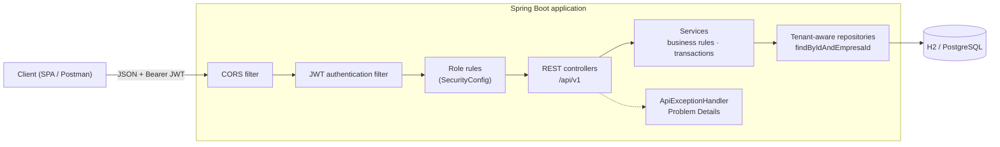
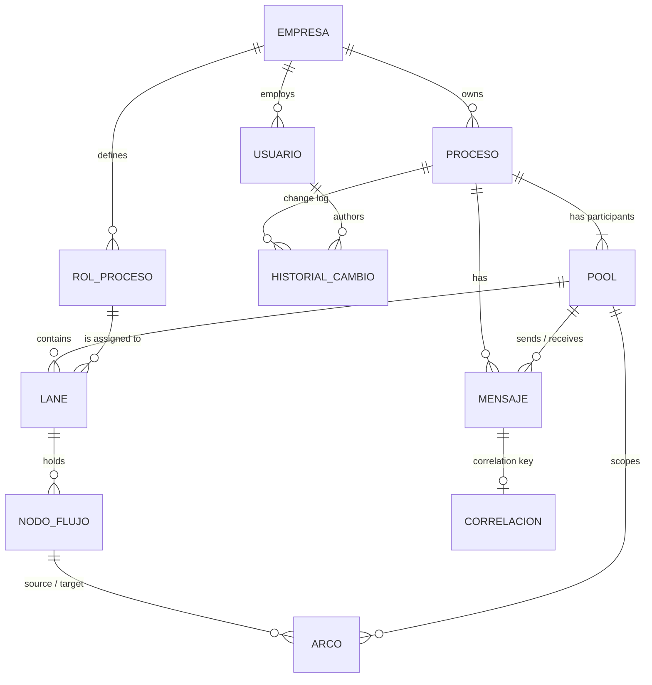

# BPMN Process Manager API

Multi-tenant REST API for modeling and validating BPMN business processes. Each company registers its own isolated
workspace, manages its users and access roles, and models complete BPMN diagrams: pools, lanes, activities, gateways,
sequence flows, message flows and correlation keys.


> **Scope:** the system models and validates processes; it does not execute them. There are no running instances,
> rule engines or calls to external systems.

## Highlights

- **Stateless JWT authentication** with a custom Spring Security filter chain and a typed `ApiPrincipal`.
- **Multi-tenant isolation by design.** The tenant comes from the token, never from the request. Repositories are
  tenant-aware, and cross-tenant access answers `404`, which prevents IDOR.
- **Role-based authorization matrix** (administrator, editor, read-only), defined in one place in the security
  configuration.
- **RFC 9457 Problem Details** for every error, including `401` and `403` raised by the security layer.
- **Versioned REST contract** under `/api/v1`: `201 Created` with `Location`, `204 No Content`, `PATCH` for state
  transitions and a pagination envelope.
- **Architecture rules enforced by tests** with ArchUnit: layering, tenant isolation and no `HttpSession`.
- **221 automated tests** with 87 % line coverage, plus a GitHub Actions pipeline that builds, tests and packages a
  Docker image.

## Tech stack

| Area | Technology |
|---|---|
| Language | Java 21 |
| Framework | Spring Boot 4.1 (Web MVC, Validation, Data JPA, Security 7) |
| Persistence | Hibernate 7.4 · H2 (development) · PostgreSQL (production) |
| Security | JWT (jjwt 0.12.6, HS256) · BCrypt |
| API docs | springdoc-openapi 3 (OpenAPI 3 + Swagger UI) |
| Testing | JUnit 5 · Mockito · MockMvc · AssertJ · ArchUnit 1.4 · JaCoCo |
| Tooling | Maven Wrapper · Lombok · Docker · GitHub Actions · SonarQube |

## Architecture



The code is split into two business modules. Each one is layered as controller → service → repository → model.

| Module | Responsibility |
|---|---|
| `security` | Filter chain, JWT issuing and validation, `ApiPrincipal`, 401/403 handlers, CORS |
| `common` | Tenant base entity, tenant-aware repository contract, business exceptions, Problem Details, pagination |
| `gestion` | Management: companies, users, processes, process roles and change history |
| `modelado` | BPMN modeling: pools, lanes, activities, gateways, sequence flows, message flows, correlation keys |

**Request lifecycle:**
1. The JWT filter validates the token and loads an `ApiPrincipal` (`usuarioId`, `empresaId`, role).
2. The role rules decide `401` or `403` before any controller runs.
3. Controllers receive the principal with `@AuthenticationPrincipal` and pass `empresaId` explicitly to the services.
4. Every lookup by id goes through `findByIdAndEmpresaId`, so a resource from another company does not exist for
   the caller.

## Domain model



The domain uses the Spanish names of the original specification:

| Entity | Meaning |
|---|---|
| `Empresa` | Company (tenant) |
| `Usuario` | User with an access role: `ADMINISTRADOR`, `EDITOR`, `SOLO_LECTURA` |
| `Proceso` | Business process, `BORRADOR` (draft) or `PUBLICADO` (published) |
| `RolProceso` | Process role, the responsibility shown as a lane |
| `HistorialCambio` | Who changed a process and when |
| `Pool` / `Lane` | BPMN participant and its responsibility bands |
| `NodoFlujo` | Flow node, stored with single-table inheritance: `Actividad` (activity) and `Gateway` (`EXCLUSIVO`, `PARALELO`, `INCLUSIVO`) |
| `Arco` | Sequence flow between two nodes of the same pool |
| `Mensaje` / `Correlacion` | Message flow between pools and its correlation key |

Every entity except `Empresa` extends `EntidadEmpresa`, which holds a mandatory, non-updatable `empresa_id`.

**Business rules:**
- Sequence flows never cross pools.
- Messages only connect two different pools.
- A published process cannot go back to draft.
- Process and process-role names are unique within a company, and flow-node names are unique within a process.
- A process role that is in use cannot be deleted.
- Processes and process roles are soft-deleted, so they keep their traceability.

## Security model

1. `POST /api/v1/empresas` registers a company together with its first administrator.
2. `POST /api/v1/auth/login` returns an access token. Its claims are the email, `usuarioId`, `empresaId` and the
   role. It expires after 30 minutes by default and is signed with `JWT_SECRET`.
3. Clients send `Authorization: Bearer <token>`. The filter reloads the user on each request, so a deactivated user
   loses access immediately.

| Operation | `ADMINISTRADOR` | `EDITOR` | `SOLO_LECTURA` |
|---|:---:|:---:|:---:|
| Read processes, process roles and BPMN elements | ✅ | ✅ | ✅ |
| Create and update processes and BPMN elements | ✅ | ✅ | ❌ |
| Delete processes and BPMN elements | ✅ | ❌ | ❌ |
| Manage process roles | ✅ | ❌ | ❌ |
| Manage users | ✅ | ❌ | ❌ |

Public endpoints are limited to company registration, login, the API documentation and, in development, the H2
console.

## Multi-tenancy and IDOR prevention

Tenant isolation does not depend on remembering to add a filter; the design enforces it:

```java
@NoRepositoryBean
public interface RepositorioTenant<T extends EntidadEmpresa> extends JpaRepository<T, Long> {
    Optional<T> findByIdAndEmpresaId(Long id, Long empresaId);
    List<T> findAllByEmpresaId(Long empresaId);
    boolean existsByIdAndEmpresaId(Long id, Long empresaId);
}
```

- **Every tenant repository extends `RepositorioTenant`.** ArchUnit fails the build if a service calls the unfiltered
  `findById` or `findAll`.
- **Ids that arrive in a request body are resolved the same way.** A lane cannot point to another company's process
  role, and a sequence flow cannot connect another company's nodes.
- **No request DTO carries an `empresaId`.** This is an ArchUnit rule too: the client never chooses the tenant.
- **Cross-tenant access answers `404`, not `403`,** so the API does not confirm that the resource exists.
- **An integration suite tests the tenant boundary.** It creates two companies and has one try to read, change or
  link the other's resources (47 cases).

## API overview

Interactive documentation is available at `/swagger-ui.html` once the application is running, and the OpenAPI
document at `/v3/api-docs`.

| Resource | Endpoints |
|---|---|
| Companies | `POST /api/v1/empresas` |
| Authentication | `POST /api/v1/auth/login` · `POST /api/v1/auth/logout` |
| Users | `GET, POST /api/v1/usuarios` · `GET, PATCH, DELETE /api/v1/usuarios/{id}` |
| Processes | `GET, POST /api/v1/procesos` · `GET, PUT, PATCH, DELETE /api/v1/procesos/{id}` · `GET /api/v1/procesos/{id}/historial` |
| Process roles | `GET, POST /api/v1/roles` · `GET, PUT, DELETE /api/v1/roles/{id}` |
| Pools | `GET, POST /api/v1/procesos/{procesoId}/pools` · `GET, PUT, DELETE /api/v1/pools/{id}` |
| Lanes | `GET, POST /api/v1/pools/{poolId}/lanes` · `GET, PUT, DELETE /api/v1/lanes/{id}` |
| Activities | `GET, POST /api/v1/lanes/{laneId}/actividades` · `GET, PUT, DELETE /api/v1/actividades/{id}` |
| Gateways | `GET, POST /api/v1/lanes/{laneId}/gateways` · `GET, PUT, DELETE /api/v1/gateways/{id}` |
| Sequence flows | `POST /api/v1/arcos` · `GET /api/v1/pools/{poolId}/arcos` · `GET, PUT, DELETE /api/v1/arcos/{id}` |
| Message flows | `GET, POST /api/v1/procesos/{procesoId}/mensajes` · `GET, PUT, DELETE /api/v1/mensajes/{id}` |
| Correlation keys | `GET, PUT /api/v1/mensajes/{mensajeId}/correlacion` |

The process list accepts `nombre`, `estado`, `categoria` and `pagina`, and returns a pagination envelope:

```json
{ "content": [ ... ], "page": 0, "size": 10, "totalElements": 23, "totalPages": 3 }
```

State transitions use `PATCH`, for example `PATCH /api/v1/procesos/42` with `{ "estado": "PUBLICADO" }`.

Errors follow RFC 9457:

```json
{
  "title": "Recurso no encontrado",
  "status": 404,
  "detail": "Proceso no encontrado.",
  "instance": "/api/v1/procesos/99"
}
```

## Getting started

**Requirements:** JDK 21, or Docker.

```bash
./mvnw spring-boot:run
```

The API starts on `http://localhost:8080` with a file-based H2 database under `./data`. A demo administrator is seeded
at startup (`admin@demo.com` / `admin123`). If `JWT_SECRET` is not set, a random signing key is generated, so tokens
become invalid after a restart.

**Quick tour:**

```bash
# 1. Register a company and its administrator
curl -s -X POST http://localhost:8080/api/v1/empresas -H "Content-Type: application/json" \
  -d '{"nombreEmpresa":"Acme","nit":"900123456","correoContacto":"contact@acme.com","nombreAdmin":"Ana","emailAdmin":"ana@acme.com","passwordAdmin":"secret123"}'

# 2. Log in and keep the token (requires jq)
TOKEN=$(curl -s -X POST http://localhost:8080/api/v1/auth/login -H "Content-Type: application/json" \
  -d '{"email":"ana@acme.com","password":"secret123"}' | jq -r .accessToken)

# 3. Create a process: it starts as a draft with an initial pool
curl -s -X POST http://localhost:8080/api/v1/procesos -H "Authorization: Bearer $TOKEN" \
  -H "Content-Type: application/json" \
  -d '{"nombre":"Vacation request","descripcion":"Employee vacation approval","categoria":"HR"}'
```

A Postman collection with every endpoint is included in [`postman/`](postman/).

### Docker

```bash
docker build -t bpmn-process-manager-api .
docker run -p 8080:8080 \
  -e JWT_SECRET=<at-least-32-random-characters> \
  -e SPRING_DATASOURCE_URL=jdbc:h2:mem:procesos \
  bpmn-process-manager-api
```

The image is a multi-stage build that runs as a non-root user. This command uses an in-memory database; for
persistent data, use the `prod` profile with PostgreSQL.

### PostgreSQL (`prod` profile)

| Variable | Purpose | Default |
|---|---|---|
| `SPRING_PROFILES_ACTIVE` | Set to `prod` to use PostgreSQL | none |
| `DB_HOST` · `DB_PORT` · `DB_NAME` | Database location | `localhost` · `5432` · `procesos` |
| `DB_USER` · `DB_PASSWORD` | Database credentials | `procesos` · empty |
| `JWT_SECRET` | HS256 signing key (required in `prod`, at least 32 bytes) | none |
| `JWT_EXPIRATION_SECONDS` | Access token lifetime | `1800` |
| `CORS_ALLOWED_ORIGINS` | Allowed front-end origins | `http://localhost:4200` |

## Testing

```bash
./mvnw verify
```

The build runs 221 tests and a JaCoCo coverage check. The HTML report is written to `target/site/jacoco/index.html`.

| Suite | Tests | What it covers |
|---|---:|---|
| Architecture (ArchUnit) | 20 | Layering, packaging, tenant isolation, JPA inheritance, no `HttpSession` |
| Controller slices (`@WebMvcTest`) | 90 | Routes, status codes, JSON shape and validation, with the real security rules |
| Service unit tests (Mockito) | 19 | Business rules of the management module |
| Security and isolation (`@SpringBootTest`) | 91 | Two-company IDOR suite, role matrix, JWT tampering and expiry, end-to-end 401/403 |
| Application context | 1 | The full context starts |

Current coverage: 87 % of lines and 58 % of branches.

## Project structure

```text
src/main/java/com/facimus/procesos
├── common/        tenant base entity, tenant-aware repository, business exceptions
│   └── api/       ApiExceptionHandler (Problem Details), PageResponse
├── config/        OpenAPI definition, demo data initializer
├── security/      SecurityConfig, JWT service and filter, ApiPrincipal, 401/403 handlers, CORS
├── gestion/       management module: controller (+ dto) · service · repository · model
└── modelado/      BPMN modeling module: controller (+ dto) · service · repository · model

src/test/java/com/facimus/procesos
├── arquitectura/  ArchUnit rules
├── gestion/       controller slices and service unit tests
├── modelado/      controller slices
└── security/      JWT, role matrix and two-tenant isolation tests
```

## Design decisions

- **`404` instead of `403` across tenants.** Answering "forbidden" would confirm that the resource exists.
- **The tenant comes only from the token.** Request DTOs cannot carry an `empresaId`, and ArchUnit enforces it.
- **The user is reloaded on every request.** Deactivating a user takes effect immediately, at the cost of one
  indexed query per request. Pure claim-based tokens would need a short lifetime plus refresh tokens instead.
- **Single-table inheritance for flow nodes.** Activities and gateways share one table and one identity, so sequence
  flows can point to either of them.
- **Soft delete for processes and process roles.** They keep their history, and deleted resources answer `404`.
- **One error format.** Validation, business and security errors all return Problem Details, so clients handle a
  single shape.

## Roadmap

**Security**
- [ ] Enforce globally unique user emails, so a new company cannot reuse an existing user's login email
- [ ] Authenticate through `AuthenticationManager` + `UserDetailsService`, without revealing whether an email exists
- [ ] Short-lived access tokens with refresh tokens
- [ ] Rate limiting on login (`429` + `Retry-After`)
- [ ] `WWW-Authenticate: Bearer` header on `401` responses

**Persistence**
- [ ] Flyway migrations with `ddl-auto=validate`, composite unique constraints and `empresa_id` indexes
- [ ] Soft delete and change history for every BPMN element
- [ ] Auditing fields (`createdBy`, `lastModifiedBy`) filled from the authenticated principal
- [ ] Optimistic locking with `@Version`, returning `409 Conflict` on concurrent edits
- [ ] Lazy associations with entity graphs and read-only transactions

**API contract**
- [ ] Full OpenAPI documentation (`@Tag`, `@Operation`, `@ApiResponse`, `@Schema`), with Swagger UI disabled in production
- [ ] Field-level validation errors in Problem Details
- [ ] `Pageable`-based pagination with stable sorting for every collection that can grow
- [ ] Aggregate endpoint that returns a complete BPMN diagram for the front end

**Architecture**
- [ ] Request/response DTO packages with MapStruct mappers; services exposed as interfaces
- [ ] Module boundaries between `gestion` and `modelado` enforced by ArchUnit (no dependency cycles)
- [ ] Spring profiles: `dev` with seed data, `test` with an isolated in-memory database, `prod`

**Quality and operations**
- [ ] Repository tests with `@DataJpaTest` and unit tests for every modeling service
- [ ] Coverage gate per package (services ≥ 70 %, branches included)
- [ ] SonarCloud quality gate on pull requests
- [ ] k6 load tests
- [ ] Docker Compose with PostgreSQL and Actuator health checks

## Credits

This project began as a five-person team project for the Web Development course of my Systems Engineering degree. It
was built in the team repository [Facimus-Curiositatem/Beta-back](https://github.com/Facimus-Curiositatem/Beta-back),
and the first commit here is a snapshot of that repository.

My contributions to the team version:

- **Stateless security:** the Spring Security filter chain, JWT issuing and validation, `ApiPrincipal`, Problem Details
  responses for `401`/`403`, and CORS.
- **Multi-tenancy and authorization:** tenant checks on every lookup, including listings by parent resource and ids
  received in request bodies; the cross-tenant `404` policy (IDOR prevention); the centralized role matrix; the
  ArchUnit isolation rules; and the two-company integration suite.

This repository is my personal continuation of the project. It evolves independently from the team version, following
the roadmap above.
