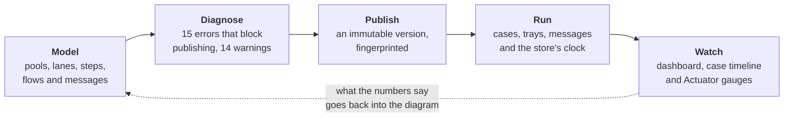
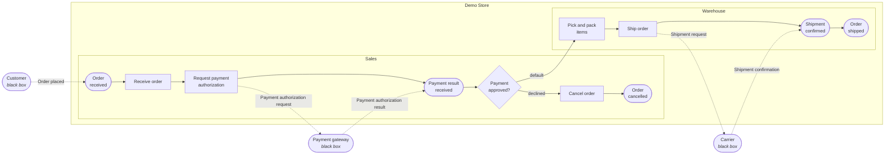
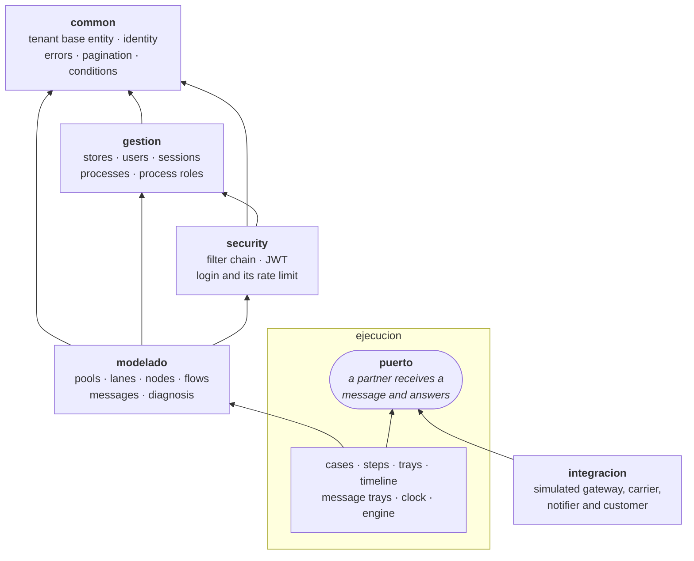
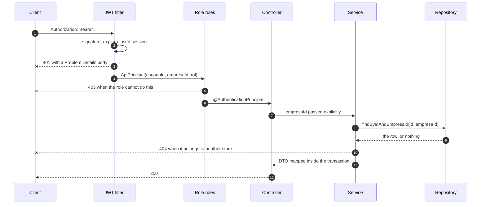

# BPMN Process Manager API

**Model, validate and run the workflows behind every online order.**

BPMN Process Manager is a multi-tenant platform where online stores draw how their orders move — from checkout to
delivery, payments and returns — as BPMN process diagrams, and then run them. A published diagram becomes an
immutable version; orders open on it as cases, wait in the trays of the people who have to move them, exchange
messages with payments, shipping and notification partners, and end up counted on an operations dashboard. Each
store works in a private workspace with role-based access, and every change is validated and recorded. This
repository holds the REST API and the Angular web app built on it.

[](https://github.com/AndresContreras1/bpmn-process-manager-api/actions/workflows/ci.yml)


[](LICENSE)

> [!NOTE]
> Orders run on a clock made of ticks that somebody moves on purpose, against simulated partners. Nothing here calls
> a real payment provider or carrier, and that is the point: the same store, the same seed and the same steps always
> decide the same way, so a demo and a test can be replayed exactly.

## What it does



A store draws its process, the diagnosis refuses to publish one that would not run, and publishing freezes the
diagram into a version. From then on an order is a case walking that exact version: it stops where a person has to
act, sends what the diagram says it sends, waits for the answer, and closes. Publishing again does not move an
order that is already running — it finishes on the diagram it started with.

## Run it

```bash
./mvnw spring-boot:run
```

That is the whole thing: `http://localhost:8080`, an H2 file under `./data`, and *Demo Store* already seeded with a
published order-fulfillment process. Swagger UI is at `/swagger-ui.html`.

```bash
TOKEN=$(curl -s -X POST http://localhost:8080/api/v1/auth/login -H "Content-Type: application/json" \
  -d '{"email":"admin@demo.com","password":"admin123"}' | jq -r .accessToken)
curl -s http://localhost:8080/api/v1/procesos -H "Authorization: Bearer $TOKEN"
```

For something closer to production — PostgreSQL 16, the `prod` profile, a health check the container waits on:

```bash
cp .env.example .env     # DB_PASSWORD and JWT_SECRET have no default on purpose
docker compose up -d --build
```

[Getting started](#getting-started) has the rest: the web app, the Postman collection and the operations endpoints.

## Contents

**Product**

1. [Overview](#overview)
2. [How it works](#how-it-works)
3. [Example: order fulfillment](#example-order-fulfillment)
4. [Roles and permissions](#roles-and-permissions)
5. [Built-in guarantees](#built-in-guarantees)

**Technical documentation**

6. [Getting started](#getting-started)
7. [Configuration](#configuration)
8. [Domain model and rules](#domain-model-and-rules)
9. [Security](#security)
10. [API reference](#api-reference)
11. [Architecture](#architecture)
12. [Quality and testing](#quality-and-testing)
13. [Design decisions](#design-decisions)
14. [Roadmap](#roadmap)
15. [Credits](#credits)
16. [License](#license)

## Overview

### The problem

A single online order crosses several teams and outside companies: the storefront, a payment provider, the warehouse
and a carrier. When that workflow only lives in people's heads, handoffs break. Payments get captured for orders that
never ship, returns stall between teams, and every new hire learns the process by trial and error.

### The solution

The platform turns each workflow into a shared model that everyone reads the same way: who does each step, in which
order, where decisions are made, and what information is exchanged with customers and partners. Models use BPMN
(Business Process Model and Notation), the standard notation for business processes (ISO/IEC 19510), so any analyst
can read them.

A published model is not only a drawing: orders run on it. Opening a case walks the diagram step by step, leaves
each task in the tray of the role that has to do it, and takes the decisions the gateways describe, so the picture
on the wall and what the store actually does are the same thing.

### Who it is for

| Audience | What they get |
|---|---|
| Store owners and operations managers | One up-to-date map of how orders are handled, with the history of every change |
| Process editors and team leads | A modeling workspace that rejects design mistakes the moment they are made |
| Partner companies | Read-only access to the processes that a store decides to share with them |
| Developers | A documented REST API for back-office tools, with the included web app as a first client |

### Key concepts

| Term | Meaning | Example |
|---|---|---|
| Process | A workflow that the store runs again and again | Order fulfillment |
| Participant (pool) | A company or system that takes part in the process | The store, the customer, the payment gateway |
| Lane | A team or role inside a participant | Sales, Warehouse |
| Event | Something that happens: where the process starts, where it waits for a message, and where a path ends | Order received |
| Activity | A unit of work, done by a person, by the store itself, or to send or receive a message | Pick and pack items |
| Gateway | A point where the flow splits or merges. When it splits, an exclusive gateway takes exactly one path, an inclusive gateway takes every path whose condition holds, and a parallel gateway takes all of them. | Payment approved? |
| Sequence flow | The order of the steps inside a participant, with an optional condition | Payment approved? → Pick and pack items |
| Message flow | Information exchanged between two participants, sent from one step and awaited at another, with the fields it carries | Payment authorization request |
| Correlation key | The value that ties together the messages of one case | `orderId` |
| Diagnosis | What a diagram gets wrong against the modeling rules: errors and warnings, each one pointing at an element | *Nothing leads to "Pick and pack items"* |
| Published version | The diagram frozen the day it was published. It does not change when the model does: what is edited afterwards is the draft | Version 2 of *Order fulfillment* |
| Case | One run of a published version, from start to end | Order `ORD-1001` |
| Task | A step of a case that waits for a person, in the tray of its lane's role | *Pick and pack items* of `ORD-1001`, waiting for Warehouse |
| Membership | Which process roles a person belongs to, so they can ask for their own tray | *Ana* is in *Warehouse* |
| Case variables | What the case knows, and what the conditions of its gateways read | `payment.status`, `order.total` |

## How it works

1. **Register the store.** The store gets its private workspace and its first administrator.
2. **Invite the team.** The administrator adds users and gives each one an access level: administrator, editor or
   read-only. A user can be created without a password: the API answers a temporary one, once, and that person can
   do nothing until they change it.
3. **Define process roles.** Roles describe who does the work, such as *Sales* or *Warehouse*, and every process of
   the store can reuse them.
4. **Model the process.** Editors add the participants, a lane for each role, the events where the process starts
   and ends, the activities and gateways, the order between them, and the messages exchanged with other
   participants. Everything can be corrected afterwards without starting over: a step moves to another lane, an
   arrow is reconnected to a different step, and lanes and participants are reordered as a whole.
5. **Validate as you go.** Every change is checked against the modeling rules: a step that cannot send a message
   does not get one, and a message that may fail says what the process does then. A change that would break a rule
   is rejected with the reason, so a model never ends up in an invalid state.
6. **Ask what is missing.** At any moment the diagram can be checked against the whole catalogue of rules: what
   is unreachable, what has nowhere to go, which decision has no alternative path, which message nobody sends. The
   same question answers what would be left if an element were deleted, so a deletion can be confirmed knowing what
   it takes with it.
7. **Publish.** When the process is ready, publishing it saves the whole diagram as a version, which never
   changes again. Publishing is refused while the diagnosis finds errors. What is edited afterwards is the draft,
   and the process says so; publishing again saves the next version, and publishing without having changed anything
   is refused.
8. **Share.** An administrator can give a partner company on the platform read-only access to a process, for example
   a logistics provider that needs to see how orders are handed over. The guest reads the version in force, never
   the half-finished draft.
9. **Run it.** With a version published, an order is opened as a case, by hand or by the message that starts the
   process. It walks the diagram on its own until it needs somebody: each activity done by a person waits in the
   tray of its role, and completing it moves the case on. Gateways decide with the variables of the case, and
   everything that happens is written down, so a case that stops can be read instead of guessed at.
10. **Let the partners answer.** What the process sends to a payment gateway or a carrier goes to an outbox, and
    what comes back goes to an inbox. Nothing is real behind them: the partners are simulated, and the store's own
    clock, in ticks, decides when each message arrives. Moving the clock is what makes an order advance, and the
    same steps always give the same result.
11. **Keep track.** Every change is recorded in the process history with its author and date. Deleted items are
    retired, not erased, so the record stays complete.

The web app in [`frontend/`](frontend/) covers signing in, store registration, the account page, the process list,
detail and forms, publishing, and a diagram viewer. Modeling the diagram itself is done through the
[API](#api-reference).

## Example: order fulfillment

The platform starts with a demo store, *Demo Store*. It has a published *Order fulfillment* process that uses every
element of the notation, and a draft *Returns and refunds* process that is ready to be modeled. Sign in as
`admin@demo.com` with the password `admin123` (see [Getting started](#getting-started)).



Solid arrows are the sequence flow, dotted ones the messages. The two lanes are the two trays: *Sales* sees steps 2
and 6, *Warehouse* sees 8 and 9, and a case sits in one of them until somebody completes it.

**Participants**

| Participant | Type | Detail |
|---|---|---|
| Demo Store | The store | Two lanes: *Sales* and *Warehouse* |
| Customer | Customer | Black box: the store does not model its internals |
| Payment gateway | External system | Black box |
| Carrier | Supplier | Black box |

**Steps**

| # | Step | Kind | Lane | What happens |
|---|---|---|---|---|
| 1 | Order received | Message start event | Sales | The order of a customer starts the process. |
| 2 | Receive order | Activity, done by a person | Sales | Validate the cart, the stock and the shipping address. |
| 3 | Request payment authorization | Activity that sends a message | Sales | Send the order total to the payment gateway. |
| 4 | Payment result received | Intermediate message event | Sales | Wait for the answer of the payment gateway. |
| 5 | *Payment approved?* | Exclusive gateway | Sales | `payment.status == APPROVED` continues to step 8, and `payment.status == DECLINED` goes to step 6. |
| 6 | Cancel order | Activity, done by the store | Sales | Release the reserved stock and notify the customer. |
| 7 | Order cancelled | End event | Sales | The order ends without a shipment. |
| 8 | Pick and pack items | Activity, done by a person | Warehouse | Collect the items and prepare the package. |
| 9 | Ship order | Activity that sends a message | Warehouse | Hand the package over to the carrier. |
| 10 | Shipment confirmed | Intermediate message event | Warehouse | Wait for the carrier to confirm the shipment. |
| 11 | Order shipped | End event | Warehouse | The order ends on its way to the customer. |

**Messages**, all correlated by the `orderId` field of their body

| Message | From | To | Anchored at | How it travels | If it fails |
|---|---|---|---|---|---|
| Order placed | Customer | Demo Store | *Order received* | — | — |
| Payment authorization request | Demo Store | Payment gateway | *Request payment authorization* | Web service | Handled by *Cancel order* |
| Payment authorization result | Payment gateway | Demo Store | *Payment result received* | — | — |
| Shipment request | Demo Store | Carrier | *Ship order* | Queue | The process continues |
| Shipment confirmation | Carrier | Demo Store | *Shipment confirmed* | — | — |
| Order status notification | Demo Store | Customer | *Cancel order* | Email | The process continues |

The payment result arrives as `payment`, so the gateway of step 5 reads `payment.status`. Only *Order placed*
opens a case: the rest are matched to one that is already open.

The [diagnosis](#diagnosis) of this process answers no errors and one warning on purpose: neither branch of step 5
is marked as the default one, so an answer that is neither approved nor declined would leave the order with no
path. Marking the rejection as the default flow clears it, and it is there to be seen.

This process starts with a message, so an order of it is opened by sending *Order placed* and not by hand, which is
what the [messaging](#running-a-process) will bring. A process that starts with a plain start event can be run
today, end to end.

## Roles and permissions

| Capability | Administrator | Editor | Read-only |
|---|:---:|:---:|:---:|
| View processes, process roles and diagrams | ✓ | ✓ | ✓ |
| Create and edit processes and diagrams | ✓ | ✓ | — |
| Create and edit participants and lanes | ✓ | ✓ or — | — |
| Delete processes and diagram elements | ✓ | — | — |
| Manage process roles | ✓ | — | — |
| Manage users | ✓ | — | — |
| Share a process with a partner company | ✓ | — | — |
| Watch cases, their timeline, the tray and the dashboard | ✓ | ✓ | ✓ |
| Open a case, complete and take a task, cancel a case | ✓ | ✓ | — |
| Correct the variables of a case and retry it | ✓ | — | — |
| Say which process roles a person belongs to | ✓ | — | — |
| Read the outbox and the inbox of a process | ✓ | ✓ | ✓ |
| Send a message to a process | ✓ | ✓ | — |
| Move the store's clock, watch its simulation and ask for a batch of orders | ✓ | — | — |
| Decide how the store's simulated partners behave | ✓ | — | — |

Participants and lanes are the one row the store decides: with the setting `politicaEstructura` on
`SOLO_ADMINISTRADOR`, only administrators create and edit them, and editors keep modeling everything inside a lane.
The default is `ADMINISTRADOR_Y_EDITOR`, which is the table above.

A store always keeps at least one active administrator, and nobody can deactivate their own account. Changing a
user's access level or deactivating them takes effect at once: their open sessions are closed. Changing a password,
or having it reset, closes them too.

## Built-in guarantees

| Guarantee | What it means for the business |
|---|---|
| Private workspace | A store's data is only visible to its own users. A request for another store's data is answered as if the data did not exist. |
| Access that follows the role | Each person can only do what their access level allows, and a change of role or a deactivation applies immediately. |
| Protected sign-in | Sign-in tokens are short-lived, a copied token is detected and its session closed, and repeated failed sign-ins are paused. |
| No lost work | When two people edit the same item, the second save is refused instead of silently overwriting the first. |
| No duplicates on retries | A create request that is retried with the same idempotency key, for example after a network failure, creates the item only once. |
| Always-valid models | The modeling rules are checked on every change, not only when a process is published. |
| What is published does not move | Publishing saves the diagram as a version that never changes. The model keeps being editable, the process says when the draft is ahead of it, and a partner store always reads what was published. |
| A case runs on the version it was opened with | Publishing a new version does not move an order that is already running: it finishes on the diagram it started with. |
| One task, one person | Two people completing the same task at the same time do not complete it twice: the second is told it is already done. |
| A case that stops says why | Every decision, task and missing variable is written down in order, so an order that did not move can be read and rescued instead of started over. |
| Nothing is lost between participants | What a process sends and what reaches it are both written down, with what was done with each one. A message that arrives for nobody is kept and explained, not dropped. |
| The same message twice does not count twice | A partner that repeats a message with the same identifier gets the first answer back instead of a second order. |
| Time that can be reproduced | Orders do not age with the wall clock: the store has its own clock in ticks, moved by whoever is testing. The same steps always give the same result. |
| Partners that behave the same way twice | What the simulated gateway, carrier and notifier decide comes from the store's seed, not from chance. The same demo shown twice gives the same rejections, the same lost parcels and the same amounts. |
| Complete history | Every change keeps its author and date, and deleted items stay on record. The store reads its own history: users, roles, processes and its registration, in one place. |
| Nothing breaks by surprise | A diagram can be checked against the rules at any moment, and before deleting anything it says what would go with it and what would be left without a path. |
| A second opinion | A model can review a diagram and point out what is missing, such as a decision with no alternative path. It only advises: nothing is changed without a person. |

The [technical documentation](#getting-started) explains how each guarantee is built.

## Getting started

### Requirements

- JDK 21, or Docker, for the API
- Node.js 22 or later for the web app (optional)
- Docker for the tests that run against a real PostgreSQL (optional)

### Run the API

```bash
./mvnw spring-boot:run
```

The API starts on `http://localhost:8080` with the `dev` profile:

- The database is an H2 file under `./data`, created with *Demo Store* on the first start.
- Swagger UI is at `/swagger-ui.html`, and the OpenAPI document at `/v3/api-docs`.
- The H2 console is at `/h2-console` (JDBC URL `jdbc:h2:file:./data/procesos`, user `sa`, no password).

If `JWT_SECRET` is not set, a random signing key is generated. Access tokens then stop working after a restart, and
the refresh token, which is stored in the database, renews them.

> [!IMPORTANT]
> If you ran a version from before Flyway, delete `./data` once. Flyway builds the schema on the next start, and it
> does not adopt a schema that Hibernate created.

### First requests

The examples use `jq` to read the token.

```bash
# Sign in as the Demo Store administrator
TOKEN=$(curl -s -X POST http://localhost:8080/api/v1/auth/login -H "Content-Type: application/json" \
  -d '{"email":"admin@demo.com","password":"admin123"}' | jq -r .accessToken)

# List the store's processes
curl -s http://localhost:8080/api/v1/procesos -H "Authorization: Bearer $TOKEN"

# Read a whole process: participants, lanes, steps, flows and messages
curl -s http://localhost:8080/api/v1/procesos/{id}/diagrama -H "Authorization: Bearer $TOKEN"

# Register another store; its processes and Demo Store's are invisible to each other
curl -s -X POST http://localhost:8080/api/v1/empresas -H "Content-Type: application/json" \
  -d '{"nombreEmpresa":"Acme Store","nit":"901234567-8","correoContacto":"contact@acme.com","nombreAdmin":"Ana","emailAdmin":"ana@acme.com","passwordAdmin":"secret123"}'
```

The login also returns a `refreshToken`. Before the access token expires, exchange it for a new pair with
`POST /api/v1/auth/refresh` and the body `{"refreshToken": "..."}`.

### Run the web app

```bash
cd frontend
npm ci
npm start
```

The app opens on `http://localhost:4200`, and the Angular dev server forwards the `/api` calls to the API on port
8080. [frontend/README.md](frontend/README.md) describes its structure and conventions.

### The whole stack with one command

Database, API and web app together, each in its own container:

```bash
cp .env.example .env   # fill in DB_PASSWORD and JWT_SECRET
docker compose up -d --build --wait
```

`--wait` comes back when all three report healthy, and the app is then on `http://localhost` (or on `WEB_PORT`).

**The stack starts empty.** It runs the `prod` profile, and the demo store belongs to `dev`, so there is nothing to
sign in with yet: create your store from the app, or with `POST /api/v1/empresas`, and the account you give it is
its first administrator. To poke at the demo data instead, run the API with `dev` as described above.

The browser only ever talks to the web container: NGINX serves the compiled app and forwards everything under
`/api` to the API inside the network. So the production build has no absolute API URL in it, there is no CORS to
configure, and the same image runs anywhere without being rebuilt. The API keeps its own port for the Postman
collection and for curl, but nothing in the browser uses it.

### End-to-end tests

```bash
docker compose up -d --build --wait
./mvnw -B -f e2e/pom.xml test
```

A separate Maven module that does not hang from this pom, so `./mvnw verify` never runs it and the normal build
stays as fast as it was. It drives a headless Chrome against the stack above: signing in, creating a process,
fixing a diagram in the editor until the diagnosis lets it be published, sharing it and reading it as the other
store, and administering roles and users. [e2e/README.md](e2e/README.md) says what each scenario covers.

### Postman collection

The [Postman collection](postman/) covers a second scenario, in which *Acme Store* models how it hands orders over to
a third-party logistics (3PL) partner. Run the requests in order, one by one or with the Collection Runner. The last
folder deletes what the scenario created, children first.

The scenario tours the endpoints rather than finishing a model, so its diagram stays incomplete on purpose:
publishing it answers `409` with what the diagnosis found, which is the rule at work. To see a published process,
use the demo store of the `dev` profile, where *Order fulfillment* starts published as version 1.

The *Operacion simulada* folder is the one part that needs a finished model: a case runs on a published version, so
those requests answer `409` until the diagram passes the diagnosis and is published, and they need a plain start
event, because a process that starts with a message is opened by sending that message. It is there to document the
shape of every request of the operation.

### Docker

```bash
docker build -t bpmn-process-manager-api .
docker run -p 8080:8080 \
  -e JWT_SECRET=<at-least-32-random-characters> \
  -e SPRING_DATASOURCE_URL=jdbc:h2:mem:procesos \
  bpmn-process-manager-api
```

The image is a multi-stage build that runs as a non-root user. This command starts the `dev` profile on an in-memory
database with Demo Store. For persistent data, use the `prod` profile with PostgreSQL.

### The whole stack with Docker Compose

```bash
cp .env.example .env     # fill in DB_PASSWORD and JWT_SECRET
docker compose up -d --build
```

This brings up PostgreSQL 16 and the API in the `prod` profile, on `http://localhost:8080`. The database keeps its
data in a named volume, so `docker compose down` does not lose it; `docker compose down -v` does. The API waits for
the database to answer, and reports itself as up only once Flyway has migrated the schema, which
`docker compose up --wait` and the container health check both rely on.

`.env` is not committed. The two values without a default, `DB_PASSWORD` and `JWT_SECRET`, stop the stack until they
are set.

### Operations endpoints

| Endpoint | Who can call it | What it answers |
|---|---|---|
| `GET /actuator/health` | Anyone | `UP` or `DOWN`, with no detail of what runs behind it |
| `GET /actuator/health/liveness` · `/readiness` | Anyone | The probes a container or an orchestrator polls; readiness covers the database |
| `GET /actuator/info` | Anyone | The name and version of the running build |
| `GET /actuator/metrics` | Administrator | JVM, pool and HTTP metrics, one by one |

Nothing else is exposed: any other Actuator endpoint answers `404`.

## Configuration

### Profiles

| Profile | Activated by | Database | Demo Store | H2 console | OpenAPI and Swagger UI | SQL log |
|---|---|---|:---:|:---:|:---:|:---:|
| `dev` | Default, when no profile is set | H2 file under `./data` | ✓ | ✓ | ✓ | ✓ |
| `test` | `@ActiveProfiles("test")` in integration tests | In-memory H2, a new one for each Spring test context | — | — | ✓ | — |
| `prod` | `SPRING_PROFILES_ACTIVE=prod` | PostgreSQL | — | — | — | — |

The tests tagged `postgres` leave the profile's database aside and run against a PostgreSQL 16 container;
[Quality and testing](#quality-and-testing) says what they are for and how to run them.

### Environment variables

| Variable | Purpose | Default |
|---|---|---|
| `SPRING_PROFILES_ACTIVE` | `prod` uses PostgreSQL and leaves out the demo store and the API documentation | `dev` |
| `DB_HOST` · `DB_PORT` · `DB_NAME` | Database location | `localhost` · `5432` · `procesos` |
| `DB_USER` · `DB_PASSWORD` | Database credentials | `procesos` · empty |
| `JWT_SECRET` | HS256 signing key of at least 32 bytes. The `prod` profile does not start without it. | None |
| `JWT_EXPIRATION_SECONDS` | Access token lifetime | `900` |
| `JWT_REFRESH_EXPIRATION_SECONDS` | Refresh token lifetime. Every renewal issues a new refresh token. | `604800` (7 days) |
| `LOGIN_MAX_FAILED_ATTEMPTS` · `LOGIN_FAILED_ATTEMPTS_WINDOW` | Failed logins for an email from one address before `429`, and the window that counts them | `5` · `15m` |
| `CORS_ALLOWED_ORIGINS` | Allowed storefront or back-office origins | `http://localhost:4200` |
| `LIMPIEZA_CRON` | When the nightly purge runs. `-` turns it off. | `0 30 3 * * *` |
| `LIMPIEZA_RETENCION_SESIONES` | How long a dead session and its expired refresh tokens are kept. Never shorter than the access token lifetime. | `7d` |
| `LIMPIEZA_RETENCION_IDEMPOTENCIA` | How long a spent idempotency key is kept | `24h` |
| `SIMULACION_TICK` | How often the clock of the stores that asked for it advances one tick. A store in `MANUAL`, which is the default, never moves by itself. | `30s` |
| `DB_POOL_SIZE` | Connections to PostgreSQL, the real ceiling of concurrent work (`prod`) | `10` |
| `SERVER_THREADS` | Threads that serve requests; the rest queue up (`prod`) | `200` |
| `GEMINI_API_KEY` | Key for the AI review. Without it the review answers `503` and nothing else changes. | None |
| `GEMINI_MODEL` · `GEMINI_BASE_URL` · `GEMINI_TIMEOUT` | Model, address and how long to wait for it | `gemini-3.8-flash` · Google endpoint · `20s` |
| `REVISION_MAX_REVIEWS` · `REVISION_WINDOW` | Reviews a store can ask for, and the window that counts them | `10` · `1h` |

On startup, Flyway creates the schema or brings it up to date. The database must exist, and its user needs permission
to create tables.

## Domain model and rules

The code keeps the Spanish names of the original specification, and the API writes its error messages and history
entries in Spanish.

| Resource | Concept | Belongs to | Main attributes |
|---|---|---|---|
| `Empresa` | Store (tenant) | — | Name, NIT and contact email |
| `Usuario` | User | Store | Email (the login), access role (`ADMINISTRADOR`, `EDITOR` or `SOLO_LECTURA`) and status |
| `Proceso` | Process | Store | Name, description, category and state (`BORRADOR` or `PUBLICADO`) |
| `RolProceso` | Process role | Store | Name and description |
| `Pool` | Participant | Process | Type (`EMPRESA`, `CLIENTE`, `PROVEEDOR` or `SISTEMA_EXTERNO`), black-box flag, order and the kind of partner behind it (`integracion`) |
| `Lane` | Lane | Pool | Process role and order |
| `Actividad` · `Gateway` · `Evento` | Flow nodes | Lane | Name and position on the canvas. Activities add a description and a type (`USUARIO`, `SERVICIO`, `ENVIO` or `RECEPCION`), gateways a type (`EXCLUSIVO`, `PARALELO` or `INCLUSIVO`), and events a type (`INICIO`, `FIN`, `MENSAJE_INICIO`, `MENSAJE_INTERMEDIO` or `MENSAJE_FIN`). |
| `Arco` | Sequence flow | Pool | Source node, target node, label and condition |
| `Mensaje` | Message flow | Process | Sending and receiving pool, content, the nodes it is anchored to, how it travels (`CORREO`, `SERVICIO_WEB`, `COLA`), what the process does if it fails (`CONTINUAR`, `MANEJAR_ERROR`, `FINALIZAR`), the fields it carries, the name its body takes among the case variables, and the message that answers it |
| `Correlacion` | Correlation key | Message | The criterion that correlates the message, the field of the body that carries it, and what to do with a message that matches no open case |
| `HistorialCambio` | History entry | Process | Description, author and date |
| `Caso` | Case | Store | The process and the published version it runs on, the reference its messages are matched by, state (`ABIERTO`, `TERMINADO`, `CANCELADO`, `FALLIDO` or `ERROR`) and the case variables as JSON |
| `ActividadCaso` | Step of a case | Case | The node of the version it went through, copied by id and by name, its kind, the process role of its lane, state (`PENDIENTE`, `EN_ESPERA`, `COMPLETADA`, `FALLIDA` or `OMITIDA`), how many tokens have reached it, who took it and what they handed over |
| `EventoCaso` | Timeline entry | Case | What happened, when, and who caused it. Only inserted |
| `MembresiaRol` | Membership | Store | Which process roles a user belongs to; the pair is unique |

Every entity except `Empresa` extends `EntidadEmpresa`, which holds a mandatory `empresa_id` that cannot be updated.
Activities, gateways and events share one table through single-table inheritance, so a sequence flow can point to
any of them. The database makes each subtype fill its own type column and leaves the others empty.

### Modeling rules

- A sequence flow joins two different nodes of the same pool, so it never crosses pools. There is at most one
  sequence flow from one node to another.
- A process starts at a start event and ends at an end event: no sequence flow arrives at a start event, and none
  leaves an end event. An event that already has flows cannot be turned into a type those flows forbid.
- A sequence flow that leaves an exclusive or inclusive gateway carries a condition, because the gateway picks its
  path by those conditions. The exception is its default flow, the one it takes when no condition holds: a gateway
  has at most one, it carries no condition, and only a gateway that decides has one. Flows that enter a gateway need
  no condition, and a gateway only becomes exclusive or inclusive when every flow that leaves it has one or is the
  default.
- A message flow connects two different pools, and both must be participants of the message's process.
- A message is anchored to the node that sends it and to the node that waits for it, each one in the pool of its
  side. Only a step that can do it: a message end event or an activity that sends or serves, on one side; a message
  start or intermediate event, or a receiving activity, on the other. A black-box pool anchors nothing, because its
  inside is not modeled.
- A message that handles a failure says which activity of the sending pool handles it, and only a message that
  handles its failure names one.
- The message that answers another one comes back from the pool that received it, in the same process.
- A step moves to any lane of its process while it is still loose. Once it has sequence flows or anchored
  messages it stays in its pool, because a flow never crosses pools and a message is anchored to the node of its own
  side. A lane of another process is never a place for it.
- Moving one end of a sequence flow goes through the same rules as connecting the two nodes for the first time.
- A participant drawn as a black box has no lanes, and one that already has lanes cannot become a black box.
- Turning a gateway parallel retires the conditions of its outgoing flows and its default flow, because a parallel
  gateway follows all of them: the history says how many were retired.
- Reordering the lanes of a pool, or the participants of a process, takes the complete list of their ids, so what
  the editor shows after a drag is what gets saved.
- Flow-node names are unique within a process, including when a node is renamed.
- Process and process-role names are unique among a store's active records, ignoring case. The database enforces it
  too.
- A process role that an active process uses cannot be deleted.
- A published process cannot go back to draft.

### User rules

- User emails are unique across the platform and case-insensitive. The email is the login, and the login does not
  know the store yet.
- A store always keeps an active administrator. The last one cannot give up the role, and nobody can deactivate their
  own account. When two administrators remove each other's role at the same moment, the second change waits on a lock
  of the store's row, sees the first change and is refused with `409`.
- A user created without a password gets a temporary one. It is answered once, in the response that generates it,
  and never again: what the database keeps is its hash, like any other password.
- While a temporary password is in use, that user can only change it, log out or renew the token; everything else
  answers `403`. Changing it closes every session of the user and opens a new one, so the answer carries the tokens
  to keep.
- Passwords are at most 72 characters, which is what BCrypt reads.

### Lifecycle rules

- Publishing requires a diagnosis without errors. The `409` says how many there are and lists them in `errors`.
  Warnings do not block: a decision without a default flow is published, and the warning stays.
- Publishing saves the whole diagram as the next version, with the SHA-256 fingerprint of its canonical form. The
  fingerprint covers every field of every element and the name, description and category of the process, and leaves
  out what changes without the drawing changing: who saved it, when, and the optimistic version.
- Publishing again without having changed anything is refused with `409`, because the version would be identical.
- A version is never edited or deleted. It can be retired, and then the version in force is the newest one still
  standing; with none left, the process stays published but has nothing to show until it is published again.
  Version numbers are never reused.
- A published process cannot go back to draft.
- Everything is soft-deleted, from processes and process roles to every BPMN element. A deleted resource answers
  `404`, but it stays in the database, and an administrator can list and read the deleted processes with
  `incluirInactivos`.
- Deleting a pool retires the message flows that enter or leave it. Deleting a process (HU-06) retires its whole
  model.
- Every change to a process or its model is recorded in the process history with its author.

## Security

### Authentication

1. `POST /api/v1/empresas` registers a store together with its first administrator.
2. `POST /api/v1/auth/login` checks the credentials through Spring Security's `AuthenticationManager` and opens a
   session with two tokens:
   - The **access token** is a JWT signed with `JWT_SECRET` that expires after 15 minutes. Its claims are the email,
     `usuarioId`, `empresaId`, the role and the session (`sid`).
   - The **refresh token** is 256 random bits. The database stores only its SHA-256 hash, so a copy of the database
     cannot open a session.
3. Clients send `Authorization: Bearer <access token>`. The filter builds the principal from the claims, without a
   database query, and rejects the tokens of a closed session.
4. `POST /api/v1/auth/refresh` exchanges the refresh token for a new pair in the same session. Each refresh token
   works once. A refresh token that was already used means that a copy exists, so the whole session is closed.
5. `POST /api/v1/auth/logout` closes the session. Deactivating a user or changing their role closes all of their
   sessions, so the old role stops working at once.

Public endpoints are limited to store registration, login, token renewal, the API documentation (not published in
`prod`) and, in `dev`, the H2 console. The role matrix in [Roles and permissions](#roles-and-permissions) is defined in
one place, the security configuration, and decides `401` or `403` before any controller runs.

### Login protection

An unknown email, a deactivated user and a wrong password get the same `401`, and `DaoAuthenticationProvider` spends
the time of a BCrypt comparison even when the email does not exist. After 5 failed attempts for an email from the same
address within 15 minutes, the login answers `429` with `Retry-After` and stops checking passwords until the oldest
attempt leaves the window. Because attempts are counted per email and address, an attacker elsewhere cannot lock the
real user out.

Closed sessions and failed attempts are kept in memory, and closed sessions are reloaded from the database on
startup. A deployment with several instances would move both to a shared store such as Redis.

### Data isolation

A platform that hosts many stores must never show one store's data to another. The design enforces this instead of
relying on each query to remember a filter:

```java
@NoRepositoryBean
public interface RepositorioTenant<T extends EntidadEmpresa> extends JpaRepository<T, Long> {
    Optional<T> findByIdAndEmpresaId(Long id, Long empresaId);
    List<T> findAllByEmpresaId(Long empresaId);
    boolean existsByIdAndEmpresaId(Long id, Long empresaId);
}
```

- Every tenant repository extends `RepositorioTenant`, and ArchUnit fails the build if a service calls the unfiltered
  `findById` or `findAll`.
- Ids that arrive in a request body are resolved the same way. A lane cannot point to another store's process role,
  and a sequence flow cannot connect another store's nodes.
- No request DTO carries an `empresaId`, which ArchUnit also checks. The client never chooses the tenant, and a
  request body that still sends one is rejected with `400`.
- Access to another store's resource answers `404`, not `403`, so the API does not confirm that the resource exists.
- An integration suite creates two stores and has one try to read, change or link the other's resources (50 cases).

**Read-only sharing (HU-23).** An administrator can share a process with another store by its NIT. A process then has
two doors: the write door finds only the store's own processes, and the read door also finds the ones shared with it.
The whole diagram is the only endpoint behind the read door, and it is marked `compartido: true` for the guest. The
detail, the history and every modeling endpoint stay private to the owner, and any change from the guest answers
`404`. The guest lists what it received in `GET /api/v1/procesos/compartidos-conmigo`, and the owner's process history
records when a process was shared and when the sharing ended.

## API reference

In `dev`, the interactive documentation is at `/swagger-ui.html` and the OpenAPI document at `/v3/api-docs`. Every
operation documents what it does, what it returns and the errors it can answer, and a test fails the build when an
endpoint is left undocumented. The `prod` profile does not publish the documentation.

### Endpoints

| Resource | Endpoints |
|---|---|
| Stores | `POST /api/v1/empresas` · `GET /api/v1/empresas/actual` · `GET /api/v1/empresas/{id}` |
| Authentication | `POST /api/v1/auth/login` · `POST /api/v1/auth/refresh` · `POST /api/v1/auth/logout` |
| Users | `GET, POST /api/v1/usuarios` · `GET, PATCH, DELETE /api/v1/usuarios/{id}` · `GET, PUT /api/v1/usuarios/{id}/roles-proceso` |
| Processes | `GET, POST /api/v1/procesos` · `GET, PUT, PATCH, DELETE /api/v1/procesos/{id}` · `GET /api/v1/procesos/{id}/historial` |
| Process roles | `GET, POST /api/v1/roles` · `GET, PUT, DELETE /api/v1/roles/{id}` |
| Pools | `GET, POST /api/v1/procesos/{procesoId}/pools` · `GET, PUT, DELETE /api/v1/pools/{id}` · `PUT /api/v1/procesos/{procesoId}/pools/orden` |
| Lanes | `GET, POST /api/v1/pools/{poolId}/lanes` · `GET, PUT, DELETE /api/v1/lanes/{id}` · `PUT /api/v1/pools/{poolId}/lanes/orden` |
| Activities | `GET, POST /api/v1/lanes/{laneId}/actividades` · `GET, PUT, DELETE /api/v1/actividades/{id}` |
| Gateways | `GET, POST /api/v1/lanes/{laneId}/gateways` · `GET, PUT, DELETE /api/v1/gateways/{id}` |
| Events | `GET, POST /api/v1/lanes/{laneId}/eventos` · `GET, PUT, DELETE /api/v1/eventos/{id}` |
| Sequence flows | `POST /api/v1/arcos` · `GET /api/v1/pools/{poolId}/arcos` · `GET, PUT, DELETE /api/v1/arcos/{id}` |
| Message flows | `GET, POST /api/v1/procesos/{procesoId}/mensajes` · `GET, PUT, DELETE /api/v1/mensajes/{id}` |
| Correlation keys | `GET, PUT /api/v1/mensajes/{mensajeId}/correlacion` |
| Whole diagram | `GET /api/v1/procesos/{id}/diagrama` |
| Published versions | `GET /api/v1/procesos/{procesoId}/versiones` · `GET, PATCH /api/v1/procesos/{procesoId}/versiones/{numero}` · `GET /api/v1/procesos/{procesoId}/versiones/{numero}/diagrama` |
| Diagnosis | `GET /api/v1/procesos/{id}/diagnostico[?sinElemento=TYPE:id]` |
| AI review | `POST /api/v1/procesos/{id}/revision` |
| Store history and settings | `GET /api/v1/empresas/actual/historial` · `GET, PUT /api/v1/empresas/actual/configuracion` |
| Passwords | `POST /api/v1/auth/password` · `POST /api/v1/usuarios/{id}/restablecer-clave` |
| Process sharing | `GET, POST /api/v1/procesos/{id}/compartidos` · `GET, DELETE /api/v1/procesos/{id}/compartidos/{empresaInvitadaId}` · `GET /api/v1/procesos/compartidos-conmigo` |
| Cases | `POST /api/v1/procesos/{procesoId}/casos` · `GET /api/v1/casos` · `GET /api/v1/casos/{id}` · `GET /api/v1/casos/{id}/eventos` · `POST /api/v1/casos/{id}/cancelar` · `PATCH /api/v1/casos/{id}/variables` · `POST /api/v1/casos/{id}/reintentar` |
| Tasks | `GET /api/v1/tareas` · `GET /api/v1/tareas/{id}` · `POST /api/v1/tareas/{id}/completar` · `POST /api/v1/tareas/{id}/asignar` |
| Messaging | `POST /api/v1/procesos/{procesoId}/mensajes-entrantes` · `GET /api/v1/procesos/{procesoId}/bandeja-salida` · `GET /api/v1/procesos/{procesoId}/bandeja-entrada` · `GET /api/v1/casos/{id}/mensajes` |
| Simulation | `GET /api/v1/simulacion` · `POST /api/v1/simulacion/tick` · `POST /api/v1/simulacion/pedidos` |
| Dashboard | `GET /api/v1/procesos/{procesoId}/tablero` · `GET /api/v1/empresas/actual/tablero` |

`GET /api/v1/procesos/{id}/diagrama` returns everything a client needs to draw a process: the process and flat lists
of pools, lanes, activities, gateways, events, sequence flows, message flows and correlation keys, linked by id.
It runs one query per element type, however large the diagram grows.

State transitions use `PATCH`, for example `PATCH /api/v1/procesos/42` with `{ "estado": "PUBLICADO", "version": 3 }`,
which is what publishes a process and saves its version.

The `PUT` of an activity, a gateway or an event takes `laneId` to move it to another lane, and the `PUT` of a
sequence flow takes `origenId` and `destinoId` to reconnect it; an end that is left out keeps the one it had. The
two `orden` endpoints take `{ "ids": [...] }` with every child of the element, exactly once, in the order they
should be drawn. `GET /api/v1/procesos` and `GET /api/v1/procesos/{id}` take `incluirInactivos=true`, which only an
administrator can ask for.

### Diagnosis

`GET /api/v1/procesos/{id}/diagnostico` answers what a diagram gets wrong, checked against the modeling rules.
Unlike the [AI review](#ai-review) it is deterministic, costs nothing and needs no external service: the same
diagram always answers the same findings, in the same order. Any role can ask for it, including a store a process
was shared with.

Each finding carries a code of the catalogue, a severity, the element it is about and what to do:

```json
{
  "procesoId": 1,
  "sinElemento": null,
  "errores": 0,
  "advertencias": 1,
  "hallazgos": [
    {
      "codigo": "A-05",
      "severidad": "MEDIA",
      "elemento": "Gateway \"Payment approved?\"",
      "elementoId": 5,
      "problema": "El gateway no tiene salida por defecto: si ninguna condicion se cumple, el caso se queda sin camino.",
      "sugerencia": "Marca como salida por defecto la que deba tomarse cuando no se cumpla ninguna condicion."
    }
  ]
}
```

A code that starts with `E` is an error: something that makes the model unusable, such as a step nothing leads to
(`E-04`), a path that never reaches an end event (`E-03`), or a node that exists to exchange a message and has none
anchored (`E-11`). A code that starts with `A` is a warning: the model works, but it will probably not do what was
meant, such as an exclusive gateway with no default flow (`A-05`), a message awaited in the middle of the flow
with no correlation key (`A-03`), or a draft with changes that the published version does not include (`A-13`). The condition of a sequence flow is read with the same grammar the engine will
evaluate it with, so a condition that would not compile is reported before anyone runs the process.

**Before deleting.** `?sinElemento=TYPE:id`, for example `GATEWAY:5`, answers the diagram that would be left after
deleting that element, with the same cascade the deletion has: a pool takes its lanes, a lane its nodes, and a node
its sequence flows. `A-06` lists what would go along with it, and the rest of the findings say what would break.

```bash
curl "http://localhost:8080/api/v1/procesos/1/diagnostico?sinElemento=GATEWAY:5" -H "Authorization: Bearer $TOKEN"
```

### The store's own history and settings

`GET /api/v1/empresas/actual/historial` answers everything that happened in the store, newest first and paginated:
users created, renamed, given another role or deactivated, process roles added and removed, the registration of the
store itself, and every change to a process. Each entry says who did it, when, and what it was about, with
`recursoTipo` and `recursoId`. Administrators only.

`GET` and `PUT /api/v1/empresas/actual/configuracion` read and change what the store decides about itself. Today
that is `politicaEstructura`: with `SOLO_ADMINISTRADOR`, creating and editing participants and lanes is reserved to
administrators, and editors keep modeling steps, flows and messages inside a lane. Changing it is recorded in the
history.

```bash
curl -s -X PUT http://localhost:8080/api/v1/empresas/actual/configuracion -H "Authorization: Bearer $TOKEN" \
  -H "Content-Type: application/json" -d '{"politicaEstructura":"SOLO_ADMINISTRADOR","version":0}'
```

### Passwords

A user can be created without one: `POST /api/v1/usuarios` then answers `claveTemporal`, which is the only time it
is ever shown, and `debeCambiarClave: true`. Whoever signs in with it can only call `POST /api/v1/auth/password`,
`logout` and `refresh`; anything else answers `403` with "Debe cambiar su contraseña antes de seguir.".

`POST /api/v1/auth/password` takes the password in use and the new one. It closes every session of that user,
this one included, and answers a new session with its tokens: the ones that come back are the ones to keep.
`POST /api/v1/usuarios/{id}/restablecer-clave` does the same from the other side, for an administrator, and answers
another temporary password.

There is no email delivery: whoever creates the user passes the temporary password along by whatever means they
have. The database never keeps it in the clear.

### Published versions

Publishing a process is `PATCH /api/v1/procesos/{id}` with `{ "estado": "PUBLICADO", "version": n }`. It runs the
diagnosis first, and with a single error it answers `409` with the list in `errors` and saves nothing. Otherwise it
saves the whole diagram as the next version, exactly as `GET /procesos/{id}/diagrama` returns it, and answers the
process with `versionPublicada`.

The model keeps being editable: what is edited is the draft. A process read one by one says `borradorPendiente`,
which is true when the diagram of today is not the one in force, and the diagnosis says the same with `A-13`. It is
worked out by comparing fingerprints, so moving a step and moving it back leaves nothing pending. It does not come
in listings, where it would mean reading one whole diagram per row, nor for a guest store, which only sees what is
published.

```bash
# Publish, and read the versions
curl -s -X PATCH http://localhost:8080/api/v1/procesos/1 -H "Authorization: Bearer $TOKEN" \
  -H "Content-Type: application/json" -d '{"estado":"PUBLICADO","version":0}'
curl -s http://localhost:8080/api/v1/procesos/1/versiones -H "Authorization: Bearer $TOKEN"

# The diagram as it was published, however much the draft has changed since
curl -s http://localhost:8080/api/v1/procesos/1/versiones/1/diagrama -H "Authorization: Bearer $TOKEN"
```

A version that should not be used any more is retired by an administrator with
`PATCH /api/v1/procesos/{id}/versiones/{n}` and `{ "estado": "RETIRADA" }`. Nothing is deleted: the cases that were
opened with a version are read against it.

### Running a process

A case is one run of a published version: an order. It is opened on the version in force, with the reference its
messages will be matched by and whatever the process already knows about it, and from there it walks the diagram
on its own until it needs somebody.

```bash
# Open an order on the version in force
curl -s -X POST http://localhost:8080/api/v1/procesos/1/casos -H "Authorization: Bearer $TOKEN" \
  -H "Content-Type: application/json" \
  -d '{"referencia":"ORD-1001","variables":{"payment":{"status":"APPROVED"}}}'

# What the store is waiting for, and who has to do it
curl -s "http://localhost:8080/api/v1/tareas?rolProcesoId=2" -H "Authorization: Bearer $TOKEN"

# Complete it; whatever is handed over lands in the case variables under tarea.pickAndPackItems
curl -s -X POST http://localhost:8080/api/v1/tareas/77/completar -H "Authorization: Bearer $TOKEN" \
  -H "Content-Type: application/json" -d '{"datos":{"packedItems":3}}'

# The case with the steps it went through, and its timeline
curl -s http://localhost:8080/api/v1/casos/42 -H "Authorization: Bearer $TOKEN"
curl -s http://localhost:8080/api/v1/casos/42/eventos -H "Authorization: Bearer $TOKEN"
```

What each node does when a case reaches it:

| Node | What happens |
|---|---|
| Start event | Completes at once and puts one token on each of its outgoing flows |
| Activity done by a person | Waits in the tray of its lane's process role until someone completes it |
| Activity that sends a message, or one done by the store with a message anchored to it | Writes the message in the outbox and goes on at once |
| Activity that receives a message, or an intermediate message event | Waits until that message arrives |
| End event that sends a message | Sends it and ends that path |
| Activity done by the store with nothing anchored to it | Completes at once |
| Exclusive gateway that splits | Takes the first outgoing flow whose condition holds, in the order they were given; if none does, the default one |
| Inclusive gateway that splits | Takes every outgoing flow whose condition holds; if none does, the default one |
| Parallel gateway that splits | Takes all of them at once |
| Parallel gateway that merges | Waits until as many tokens have arrived as there are flows coming in |
| Inclusive gateway that merges | Waits while any other live token of the case can still reach it |
| Exclusive gateway that merges | Does not synchronize: every token that arrives goes on |
| End event | Consumes its token. When the last live token of the case dies, the case is finished |
| Anything in another participant | Is not run: the other pools are partners or black boxes, and what they draw inside is documentation |

**Conditions.** A gateway decides with the conditions written on its outgoing flows, in a small language of its own:
a variable of the case, one of `==`, `!=`, `>`, `>=`, `<` and `<=`, and a value, combined with `and`, `or`, `not`
and brackets. `payment.status == APPROVED` and `order.total > 5000 and order.vip == true` are conditions. There are
no function calls, no assignments and no access to anything but the variables, so a condition written by a user
cannot run code. It is the same language the diagnosis checks when publishing: a condition that is published is a
condition that runs.

A variable the case does not have makes its comparison false and leaves a note in the timeline. If that leaves a
gateway with nowhere to go, the case stops in `ERROR` with the gateway that found no path written down. An
administrator corrects the variables with `PATCH /api/v1/casos/{id}/variables` and `POST /api/v1/casos/{id}/reintentar`
evaluates that gateway again. A case can also be cancelled, which switches off its live tokens; nothing is deleted.

**Variables.** They are the JSON the case carries: what was passed when it was opened, under
`tarea.<taskNameInCamel>` whatever each person handed over when completing a task, and under the name each message
declares, the body of every message received. `caso.referencia` and `caso.tick` are always readable and come from
the case itself.

**Whose tray.** A task is born with the process role of its lane, and `GET /tareas?rolProcesoId=2` is the tray of
that role. An administrator can also say which roles each person belongs to, with
`PUT /usuarios/{id}/roles-proceso` and the whole list, and then `GET /tareas?mias=true` answers only the tasks of
the caller's roles — someone with no roles gets an empty tray. It is a filter and not a door: completing a task
still only asks for the access role, so a store that does not want to manage memberships simply never sets any.

### Messages and the clock

Participants do not call each other. What a process sends goes to an outbox, and what reaches it goes to an inbox:
two lists that can be read, which is what explains an order that is waiting. Nothing is real behind them — the
partners are simulated — and nothing is lost either.

```bash
# The order arrives as a message and opens a case; claveExterna makes sending it twice safe
curl -s -X POST http://localhost:8080/api/v1/procesos/1/mensajes-entrantes -H "Authorization: Bearer $TOKEN" \
  -H "Content-Type: application/json" \
  -d '{"nombre":"Order placed","cuerpo":{"orderId":"ORD-1001"},"claveExterna":"shop-1001"}'

# What the process has sent and what has reached it
curl -s http://localhost:8080/api/v1/procesos/1/bandeja-salida -H "Authorization: Bearer $TOKEN"
curl -s http://localhost:8080/api/v1/procesos/1/bandeja-entrada -H "Authorization: Bearer $TOKEN"

# Move the store's clock one tick: what was due is delivered and the partners answer
curl -s -X POST http://localhost:8080/api/v1/simulacion/tick -H "Authorization: Bearer $TOKEN" \
  -H "Content-Type: application/json" -d '{"ticks":1}'

# Where the simulation is, and what a case sent and received
curl -s http://localhost:8080/api/v1/simulacion -H "Authorization: Bearer $TOKEN"
curl -s http://localhost:8080/api/v1/casos/42/mensajes -H "Authorization: Bearer $TOKEN"
```

**Sending.** When a case goes through a node with a message anchored to it, the message is written in the outbox
with the fields it declares, taken from the variables of the case — a field the case does not have travels empty
and is written in the timeline. It carries the key the answer will come back with: the correlation field, or the
reference of the case. It is due one tick later, never the same tick it was sent: otherwise moving the clock once
would deliver everything at once and an order waiting for the payment gateway could never be seen.

**Receiving.** A message that arrives is matched to a case by its key, and there are four possible endings, decided
in this order: there is an open case with that key and a node waiting for that message, and it is delivered; there
is a case but it has not reached the point of waiting yet, and the message stays in the inbox until a later tick;
there is no case and the message is one that opens them, and one is opened; there is no case and it does not open
any, and it is discarded, written down. A message without a key is never delivered to a case just because the name
matches: guessing would put the answer of one order into another.

**If a message does not arrive**, the message itself says what happens: the process goes on, it is diverted to the
activity that handles the problem, or the order is given up and the case ends `FALLIDO`.

**The clock.** A store has its own clock, a counter of ticks that starts at zero and only goes up, and
`POST /api/v1/simulacion/tick` moves it. Each due message is delivered in its own transaction with its case locked,
so twenty orders move one after another rather than all at once. A store can also ask for its clock to run on its
own, with `modoSimulacion` on `AUTOMATICO`; by default it is `MANUAL`, which is what makes a demo repeatable.

### The simulated partners

Nothing on the other side of a message is real. There is no payment gateway, no carrier and no email provider:
there are four simulated partners that receive what the process sends, decide what happens and answer what the
diagram says they answer. Each store says how they behave, and everything they decide comes from the store's seed
rather than from chance — so the same demo shown twice gives the same rejections, the same lost parcels and the
same amounts.

| Partner | What it does with a message | What it answers |
|---|---|---|
| Payment gateway | Applies the store's rejection rule over the body it was sent, and what the rule does not reject is left to the rejection rate | The answer the diagram expects, with `status`, a `transactionId` and the amount, after `ticksRespuestaPagos` |
| Carrier | Takes the parcel | The tracking answer if the diagram expects one, and the delivery confirmation `ticksEntrega` later, saying `DELIVERED` or `LOST` according to the loss rate |
| Notifications | Delivers the email, the message or the call, or does not | Nothing. When it does not get through, what happens next is the message's own `siFalla` |
| Customer | Receives whatever the store sends it, always | Nothing. It also buys: a batch of orders comes from here |

**The rejection rule** is written in the same language as the flow conditions, read over the body of the outgoing
message: `total > 5000` makes every order above five thousand fail, with no chance involved. It is checked when it
is saved, not when it runs, because a rule found to be wrong halfway through a demo cannot be fixed without
stopping the demo. The rate covers what the rule does not: `0` approves everything and `100` rejects everything,
which is how a test says what it wants to happen.

```bash
# How this store's partners behave; send all of it or none of it
curl -s -X PUT http://localhost:8080/api/v1/empresas/actual/configuracion -H "Authorization: Bearer $TOKEN" \
  -H "Content-Type: application/json" \
  -d '{"politicaEstructura":"ADMINISTRADOR_Y_EDITOR","version":0,
       "simulacion":{"semilla":42,"tasaRechazoPagos":10,"ticksRespuestaPagos":1,
                     "reglaRechazoPagos":"total > 5000","ticksRespuestaTransporte":1,"ticksEntrega":3,
                     "tasaPerdidaEnvios":5,"tasaFalloNotificaciones":2}}'

# Twenty orders from the simulated customer, and then move the clock
curl -s -X POST http://localhost:8080/api/v1/simulacion/pedidos -H "Authorization: Bearer $TOKEN" \
  -H "Content-Type: application/json" -d '{"procesoId":1,"cantidad":20}'
curl -s -X POST http://localhost:8080/api/v1/simulacion/tick -H "Authorization: Bearer $TOKEN" \
  -H "Content-Type: application/json" -d '{"ticks":1}'
```

**A batch of orders** comes in as the message that opens a case of that process, one per order, with a numbered
reference and an amount made up from the seed. They enter through the same door as any other message, so a
simulated order and a real one walk exactly the same path: nothing downstream knows where they came from. A
process that is opened by hand does not take batches — its cases are opened one at a time.

### The dashboard

How operations are going, for one process or for the whole store. It answers what somebody actually asks when they
open it: how many orders there are and what state they are in, how long a finished one takes, who has work
waiting, what has been sent and received, and what did not go as expected.

```bash
curl -s http://localhost:8080/api/v1/procesos/1/tablero -H "Authorization: Bearer $TOKEN"
curl -s http://localhost:8080/api/v1/empresas/actual/tablero -H "Authorization: Bearer $TOKEN"
```

**Time is counted in ticks**, not in hours: the simulation's time is the one that can be reproduced, and mixing
the two would be counting two different things in one column. Alongside the average there is a p95 — the time that
at least ninety-five out of a hundred orders stay under. It is deliberately not the maximum: out of twenty orders,
one slow one does not move it and two do, which is what makes it worth looking at.

**What did not go as expected** is three numbers taken from the case timelines: messages that never reached the
partner, gateways that found no path, and conditions that asked for a variable the case did not have. Each one is
fixed a different way, so each one is counted separately. There is no "declined payments" column: whether a
payment was declined is a fact of the business that lives in the diagram, and the engine would have to guess it by
reading inside the body of a message — while these three it knows for certain, because it wrote them.

**It costs six queries**, whether the store has five orders or five thousand, and a test counts the statements so
it stays that way. A dashboard that grew with the orders would stop being openable exactly on the day it mattered.

For whoever runs the server rather than the store, Actuator publishes four gauges next to the memory and
connection-pool ones: `casos.abiertos`, `tareas.pendientes`, `mensajes.salientes.pendientes` and
`mensajes.entrantes.pendientes`. Those are for the whole installation — a gauge tagged per store would create a
new series every time somebody registers — and they are the administrator's, like the rest of Actuator.

### AI review

`POST /api/v1/procesos/{id}/revision` sends the diagram to a language model and answers with findings: a
severity, the element each one is about, what is wrong and what to do. Administrators and editors can ask for
it, because every review costs a call.

```bash
curl -X POST http://localhost:8080/api/v1/procesos/1/revision -H "Authorization: Bearer $TOKEN"
```

What the endpoint does not do is as important as what it does:

- **It answers in a shape, not in prose.** The request declares the schema the model must answer in, so the
  reply is read as data. Anything outside it answers `502` instead of becoming an invented review.
- **It never changes the model.** The findings are advice. A person decides what to do with them.
- **It sends the diagram in words, not the JSON of the endpoint.** Same content, no internal ids.
- **A diagram that has not changed is not reviewed twice.** The previous review comes back marked
  `reutilizada`, without a call and without spending part of the limit.
- **The limit is per store.** Beyond `REVISION_MAX_REVIEWS` in `REVISION_WINDOW`, the answer is `429` with
  `Retry-After`.
- **Without `GEMINI_API_KEY` it stays off.** The endpoint answers `503` and the rest of the API runs exactly
  as before, which is also how the test suite runs: no test makes a network call.

### Pagination

Lists that can grow (processes, process roles, users and shared processes) accept these parameters:

| Parameter | Description |
|---|---|
| `pagina` | Page number, starting at 0 |
| `tamano` | Page size, from 1 to 50. The default is 10. |
| `orden` | A field from the list's allowlist with `asc` or `desc`, such as `orden=nombre,asc` |

The id breaks ties, so no row repeats or goes missing between pages. Processes can also be filtered by `nombre`,
`estado` and `categoria`, and process roles by `nombre` (HU-20). Every list answers the same envelope:

```json
{ "content": [ ... ], "page": 0, "size": 10, "totalElements": 2, "totalPages": 1 }
```

### Concurrent edits

Every editable resource answers a `version` that increases with each saved change. A `PUT` or `PATCH` sends back the
version it read. If someone saved a change since, the request answers `409` and changes nothing, so the client can
reload and decide again. When two edits of the same version arrive at the same time, both pass that check and the
database rejects the second one through JPA's `@Version`. The correlation key of a message is the only upsert: the
first one is created without a version.

### Idempotent requests

An authenticated `POST` accepts an `Idempotency-Key` header with any unique value, such as a UUID. A retry with the
same key gets the first response back, marked with `Idempotent-Replayed: true`, instead of creating the resource
again. The same key with a different request answers `422`, and while the first request is still running, `409`. Only
successful responses are kept, so after an error the client can fix the request and retry with the same key. Keys
belong to each user.

### Auditing

Every editable resource answers `creadoPor`, `fechaCreacion`, `modificadoPor` and `fechaModificacion`, which Spring
Data auditing fills from the authenticated user. Records that the system creates without a token, such as the first
administrator of a store, have no author.

### Data that does not pile up

Three tables only grow. A login writes a session, every renewal writes a refresh token, and every request with an
`Idempotency-Key` writes a key; nothing reads any of them once they expire. A job sweeps them every night
(`LIMPIEZA_CRON`, 3:30 by default):

- **Refresh tokens** that expired more than `LIMPIEZA_RETENCION_SESIONES` ago. An expired one renews nothing.
- **Sessions** older than that same window with no refresh token left, which can no longer issue anything. The
  window is never shorter than the access token lifetime: when the API restarts it rereads the sessions closed
  recently to keep rejecting their tokens, so deleting one too early would let a revoked token back in.
- **Idempotency keys** older than `LIMPIEZA_RETENCION_IDEMPOTENCIA`.

This is the only place in the API where a row is really deleted; everything else is a soft delete and stays.

### Errors

Errors follow RFC 9457 (Problem Details):

```json
{
  "title": "Recurso no encontrado",
  "status": 404,
  "detail": "Proceso no encontrado.",
  "instance": "/api/v1/procesos/99"
}
```

A `400` for specific fields adds an `errors` map, so a client can show each message next to its field. It covers
failed validations, values of the wrong type (for enums, the message lists the valid values) and fields that the
operation does not accept:

```json
{
  "title": "Validación fallida",
  "status": 400,
  "detail": "Uno o más campos no son válidos.",
  "instance": "/api/v1/procesos",
  "errors": {
    "categoria": "La categoria es obligatoria.",
    "nombre": "El nombre es obligatorio."
  }
}
```

A business rule that the request would break answers `409` with the reason in `detail`. Every `401` carries
`WWW-Authenticate: Bearer`.

## Architecture

### Technology stack

| Area | Technology |
|---|---|
| Language | Java 21 |
| Framework | Spring Boot 4.1 (Web MVC, Validation, Data JPA, Security 7) |
| Persistence | Hibernate 7.4 · Flyway 12 · H2 (`dev` and tests) · PostgreSQL (`prod`) |
| Security | Spring Security `AuthenticationManager` · JWT (jjwt 0.12.6, HS256) · BCrypt · SHA-256-hashed refresh tokens |
| API documentation | springdoc-openapi 3 (OpenAPI 3 and Swagger UI) |
| Web app | Angular 19 · Bootstrap 5 · RxJS |
| Testing | JUnit 5 · Mockito · MockMvc · AssertJ · ArchUnit 1.4 · JaCoCo |
| Tooling | Maven Wrapper · Lombok · MapStruct · Docker · GitHub Actions · SonarCloud |

### Modules

The code is split into four business modules and two shared packages, and they stack: `common` depends on nobody,
`gestion` on `common`, `security` on both, `modelado` on the three, `ejecucion` on all of them, and `integracion`
only on the port `ejecucion` publishes. Each business module is layered as controller → service interface →
service implementation → repository → model, with `dto` for the module's contract and `mapper` for the MapStruct
translations.



An arrow means *depends on*. The only one that points the other way is the last: `ejecucion` publishes the port and
`integracion` implements it, so the engine asks for the partner of a kind of participant and works with whatever it
is given. ArchUnit checks every one of these arrows, and the absence of the ones that are not drawn.

| Package | Responsibility |
|---|---|
| `common` | What every module needs: the store and the access role, the authenticated identity (`ApiPrincipal`), the tenant base entity and the tenant-aware repository contract, business exceptions, Problem Details, pagination |
| `security` | Filter chain, the authentication endpoints, login and its rate limit, JWT issuing and validation, closed sessions, `401` and `403` handlers, CORS |
| `gestion` | Management: stores, users and their sessions, processes, process roles and change history |
| `modelado` | BPMN modeling: pools, lanes, activities, gateways, sequence flows, message flows and correlation keys |
| `ejecucion` | Running a published version: cases, the steps they go through, the tray of tasks, the timeline, the two message trays, the store's clock and the engine that moves them. It publishes the port the partner on the other side of a message is asked through |
| `integracion` | The simulated partners behind that port: the payment gateway, the carrier, the notifications provider, the customer, and the echo that stands in for a participant with no partner of its own. They receive a message and answer; they know nothing about cases, trays or who called them, and they open no connections |

### Request lifecycle

1. The JWT filter validates the token and builds an `ApiPrincipal` (`usuarioId`, `empresaId`, role and session) from
   its claims, without a database query. A token whose session was closed is rejected.
2. The role rules decide `401` or `403` before any controller runs.
3. Controllers receive the principal with `@AuthenticationPrincipal` and pass `empresaId` explicitly to the services.
4. Every lookup by id goes through `findByIdAndEmpresaId`, so a resource from another store does not exist for the
   caller.
5. The service maps the result to a DTO inside its transaction. Entities never reach the controller.



The `404` at the end is the whole multi-tenancy policy in one line: a resource of another store does not answer
`403`, because that would confirm it exists. It does not exist for the caller.

### Module boundaries

`modelado` builds on the processes and roles of `gestion`, so `gestion` never depends on `modelado`. When a process
is created, `gestion` publishes a `ProcesoCreado` event and `modelado` creates the store's pool in the same
transaction. When a process is deleted, a `ProcesoEliminado` event lets `modelado` retire the model. To know whether
a process role is in use, `gestion` asks the `UsoDeRoles` port, which `modelado` implements on top of its lanes.
Publishing works the same way: `gestion` owns the versions but not the diagram, so it asks the
`DiagnosticoDelModelo` and `InstantaneaDelModelo` ports for the errors that block publishing and for the diagram to
freeze.

`ejecucion` sits on top of all of them: it reads the published version through the service that owns it and the
diagram through the DTOs that `modelado` already answers with, and nothing below ever looks back at it, which
another ArchUnit rule checks. The language of the conditions is the one thing both sides need — the diagnosis to
refuse publishing one that does not compile, the engine to evaluate it — so it lives in `common` rather than in
either of them.

The partner on the other side of a message is the one place the direction turns around. `ejecucion` publishes a
port — a partner receives a message and answers — and `integracion` implements it; the engine asks for the partner
of a kind of participant and works with whatever it is given. Three ArchUnit rules hold that line: a simulated
partner cannot reach into the services, repositories or entities of the execution, it cannot open a connection to
anything (one that did would stop being a simulation, and the tests would start depending on something outside
answering), and the port itself cannot mention an entity, or whoever implements it would have to know the
database.

The same rule holds one level up. What every module needs — the store, the access role and the identity of whoever
is calling — lives in `common`, so nothing has to reach sideways for it, and the authentication endpoints live with
the rest of `security` instead of with the management of the store. An ArchUnit rule checks that the packages keep
stacking, at the top level and inside each module.

## Quality and testing

```bash
./mvnw verify
```

The build runs 1163 tests and a JaCoCo coverage gate. The HTML report is written to `target/site/jacoco/index.html`.

| Suite | Tests | Scope |
|---|---:|---|
| Architecture (ArchUnit) | 39 | Layering, module boundaries and cycles between packages at both levels, DTOs and mappers, tenant isolation, JPA mapping (inheritance, its own soft delete per subtype, enums, lazy associations), no `HttpSession`, a simulated partner that cannot reach into the engine or open a connection, a port that cannot mention an entity, anything that runs on its own living in `config`, and a declared profile in every `@SpringBootTest` and persistence slice |
| Controller slices (`@WebMvcTest`) | 191 | Routes, status codes, JSON shape and validation, with the real security rules |
| Service unit tests (Mockito) | 429 | Business rules of the three modules, with the repositories mocked: what each service accepts, what it refuses and what it drags along; the diagnosis catalogue, with a test that fires each code over a diagram that is right everywhere else and one that proves the healthy diagram fires none; the language of the conditions, compiled and evaluated, operator by operator; the graph a published version turns into; the engine, with one test per row of the table of what each node does, on diagrams built in memory, messages included: what a node sends, what it waits for and what each `siFalla` does when a send does not arrive; the fingerprint of a diagram, which has to change with any change of any element and stay put with everything else; the AI review against a stubbed HTTP server: what it asks for, what it accepts as an answer and what it refuses; the four simulated partners, one suite each, with the seed proving that the same store and the same steps always decide the same way; and the cycle time over lists counted by hand, where out of twenty orders one slow one does not move the p95 and two do |
| Repository slices (`@DataJpaTest`) | 67 | The hand-written queries against the real Flyway schema: the read gate for shared processes, the search filters, the ordering and role-usage queries, soft delete, the partial unique indexes, the check constraints of the flow-node table and of the default flow, the message with its anchors, its answer and its fields stored as JSON, the versions, with one number per process and a whole diagram in the column, and the named queries of the execution and of the two message trays, which do not exist as code: a renamed one does not start the application |
| Security and isolation (`@SpringBootTest`) | 253 | The two-store IDOR suite, one block of it for cases, tasks, their timeline and the message trays, read-only sharing (HU-23), the role matrix with the error body behind every `403` and `404`, JWT tampering and expiry, sessions, the login limit, idempotency keys, the last active administrator under concurrent changes, temporary passwords and the change they force, passwords that never reach a response, and end-to-end `401`, `403`, `429` and firewall `400` responses |
| Profiles, schema, queries, API contract and demo data (`@SpringBootTest`) | 39 | What `dev` and `prod` expose, what runs on its own in each one and what does not run in `test`, the size of the connection and thread pools, the Flyway migrations and unique indexes, SQL statement counts that catch N+1 queries and prove that the JWT filter runs no SQL, the OpenAPI contract, what Actuator publishes and to whom, the four gauges of the operation included, and the demo data read through the API |
| Module integration (`@SpringBootTest`) | 143 | Process-role usage across modules, who sees which tray, the order of pools and lanes, the whole diagram, publishing into versions and the draft that goes ahead of them, the store history and the structure policy, optimistic locking on every edit, auditing, soft delete, the modeling history, the BPMN consistency rules, an order from opening to finishing through both trays, two people completing the same task at the same time, the four endings of the correlation of a message, the store's clock and what each tick delivers, and the whole demo order end to end: it arrives as a message, two people move it, the clock delivers what it sent and the partners answer, and it finishes shipped — twenty of them at a time, and every one of them cancelled instead when the rejection rate says so; and the dashboard over figures counted by hand, with a statement count that keeps it at six queries however many orders there are, and an order cancelled on purpose to prove that the cycle time counts only the ones that finished |
| Application context | 2 | The full context starts in the `test` profile, without the demo store |
| PostgreSQL 16 (Testcontainers) | 79 | What only the production engine can answer: the partial unique indexes behind the name of a process and the pair of nodes of a flow, which H2 has to replace with a generated column, and the `text` columns that hold a published diagram, the variables of a case and the bodies of the messages. The migration, repository, version, publishing, execution, messaging, simulation and whole-demo suites run again here, unchanged, and the context starts with `validate`, so every entity is checked against the schema Flyway leaves behind |

The PostgreSQL row is the only one `./mvnw verify` does not run: it needs a Docker daemon, and a build that
depends on one is a build that breaks on the laptop of whoever does not have it. Those tests carry the
`postgres` tag, which the build excludes and this command runs on its own:

```bash
./mvnw test -Dsurefire.excluded.groups= -Dgroups=postgres
```

Without Docker they report as skipped instead of failing, and the pipeline runs them on every pull request.

Current coverage: 96 % of lines and 85 % of branches. The build fails below 85 % of lines or 70 % of
branches overall, and below 90 % and 80 % in the service packages, where the business rules live. The gate
leaves out DTOs and Spring configuration: they are records and wiring, and counting them only inflates the number.

Every push to `main` and every pull request runs the GitHub Actions pipeline:

| Job | What it checks |
|---|---|
| Build & Test | `./mvnw verify` on Ubuntu and Windows. The test results appear as a check, and the coverage report is kept as an artifact. |
| Architecture Rules | The ArchUnit suite on its own, with a summary |
| PostgreSQL Integration | The suites tagged `postgres` against a PostgreSQL 16 container, the same image the Compose stack runs |
| Docker Image & Load Test | Builds the image, checks that the API answers from the container, brings up the Compose stack in the `prod` profile against PostgreSQL 16, and runs the two k6 load tests against it: one that loads reading the model and one that loads running it |
| SonarCloud Analysis | Static analysis and its quality gate: the job waits for SonarCloud to judge the analysis and goes red when the gate does not pass. Skipped while the token is not configured |
| Frontend Build | `npm ci` and a production build of the web app |

## Design decisions

- **`404` instead of `403` across stores.** Answering "forbidden" would confirm that another store's resource exists.
- **The tenant comes only from the token.** Request DTOs cannot carry an `empresaId`, and ArchUnit enforces it.
- **Claims instead of a query per request.** The filter trusts the signed claims, so authenticating a request runs no
  SQL. The one thing a signed token cannot know, that its session was closed, comes from an in-memory list filled by
  the logout, a reused refresh token, a deactivation or a role change. Access tokens last 15 minutes, so the list only
  needs to remember a session that long.
- **Refresh tokens rotate and work once.** A stolen refresh token either fails, because its owner already used it, or
  closes the session as soon as the owner uses theirs. The database keeps SHA-256 hashes: the tokens are already
  random, so BCrypt adds nothing, and the hash has to be searchable.
- **The version travels in the body.** A single-page app edits a resource through a form, so sending the `version`
  back with the other fields is simpler than the `ETag` and `If-Match` headers of HTTP. The API still refuses an
  edit without it.
- **A row lock guards the last administrator.** Two administrators who remove each other's role change different
  rows, so optimistic locking alone would let both changes through. Locking the store's row makes the second change
  wait and count again.
- **A version is a snapshot, not a copy of the process.** Publishing stores the diagram as JSON instead of cloning
  the process with its whole model. Cloning would break the unique name per store, multiply rows, and force every
  modeling service to know about versions; a snapshot never changes, so it is also the obvious candidate for a
  second-level cache. What tells two versions apart is the SHA-256 fingerprint of the diagram reduced to what draws
  it, so saving without changing anything does not count as a change.
- **A case is a list of steps, not a table of tokens.** Every time a case goes through a node it leaves a row with
  the name the node had and its state, so reading a case is reading where it has been. The live tokens are the rows
  that are still pending or waiting, and the tray of tasks is a query over them. A table of marks would be exact and
  unreadable.
- **A row lock guards a case, not a version number.** Completing a task, receiving a message and moving the clock
  can all touch the same case, and they touch different rows of it, so optimistic locking would let two of them
  through. Every operation that moves a case starts by locking its row, and whoever completes a task locks the case
  **before** reading the task: the other way round, the second person would keep the state they read before waiting
  and complete it twice.
- **Conditions have their own language.** What is written on a flow is written by a user, so it is read with a
  grammar of the project's own — variables, six comparators, `and`, `or`, `not` and brackets — and never with SpEL
  or a script engine, which would let that text call methods. The same parser answers the diagnosis when publishing
  and the engine when running, so a condition that publishes is a condition that runs, and an ArchUnit rule keeps
  anything that executes code out of the build.
- **A missing variable is false, and says so.** A comparison over a variable the case does not have is false rather
  than an error, and leaves a note in the timeline. An order does not fall over because a partner sent one field
  less; it stops at the gateway that has nowhere to go, with the reason written down.
- **The queries of the execution are named queries.** The reads the operation depends on live on the entity as
  `@NamedQuery`, so a renamed one fails to start the application and its test, instead of failing a request on a
  Tuesday afternoon.
- **Single-table inheritance for flow nodes.** Activities and gateways share one table and one identity, so sequence
  flows can point to either of them.
- **Soft delete everywhere.** Processes and process roles carry their own `activo` flag. BPMN elements use Hibernate's
  `@SQLDelete` and `@SQLRestriction`, so a delete becomes an update and no query sees retired rows. Hibernate's
  `@SoftDelete` would have forced eager to-one associations, against the project's lazy-loading rule. A unique
  constraint that a retired row would still hold, such as the pair of nodes of a sequence flow, only counts active
  rows.
- **One job deletes, and only technical rows.** Sessions, refresh tokens and idempotency keys are the only
  tables that grow with nobody reading them back, so a nightly sweep is the single physical `DELETE` in the API,
  and the only place that crosses stores on purpose: it reads nobody's data, it drops rows that are useless to
  everyone. A session waits until it has no refresh token left and until no access token of it can still be alive.
- **One error format.** Validation, business and security errors all return Problem Details, so clients handle a
  single shape.
- **Unknown fields are errors.** Jackson fails on properties that the contract does not define, so a typo or a
  smuggled `empresaId` gets a `400` instead of being silently dropped.
- **The demo data goes through the services.** The seed cannot create a diagram that the API itself would reject.
- **Services return DTOs.** MapStruct maps inside the service transaction, so `open-in-view` stays off and no lazy
  association is read after the session closes. Controllers depend on service interfaces, never on their
  implementations.
- **Lazy associations, explicit fetching.** Every association is `LAZY`. A list that shows associated data fetches it
  with an `@EntityGraph`, and a test counts SQL statements so that an N+1 query fails the build.
- **A one-way dependency between modules.** Events and a port let `modelado` react to and answer `gestion` without
  `gestion` knowing `modelado`, so the modules can grow without a cycle. The same holds between the four top-level
  packages: what everyone needs sits in `common` rather than being borrowed from a neighbour, and an ArchUnit rule
  fails the build the day someone points one of them backwards.
- **The schema belongs to Flyway.** Migrations are the single source of truth, and Hibernate only validates them
  (`ddl-auto=validate`). Portable SQL lives in `db/migration/common`. What only one engine can express, such as
  PostgreSQL's partial unique indexes, lives in `db/migration/{vendor}`, and H2 gets an equivalent built on a
  generated column. Each branch is proved against its own engine: the H2 one by the build of every day,
  the PostgreSQL one by the suite that runs on a container.
- **A published diagram is text in the row, not a large object.** Hibernate turns `@Lob` on a `String` into
  an `oid` in PostgreSQL: the document moves out of the table into the large-object store, with its own
  identity and its own cleanup, and plain SQL stops reading it. The column asks for `text` and the field
  asks for the JDBC type that matches it, so the JSON stays in the row on both engines.
- **Every text column has a length, and so does its request field.** A value that is too long answers `400` before it
  reaches the database. Passwords stop at 72 characters, because BCrypt only reads 72 bytes and Spring Security
  rejects longer ones.
- **Tests never touch the development database.** Every `@SpringBootTest` and every `@DataJpaTest` declares its
  profile, which an ArchUnit rule checks, and the `test` profile gives each Spring context its own in-memory
  database. The persistence slices keep that database rather than the one the slice would substitute, so they run
  against the schema Flyway creates, check constraints included.

## Roadmap

**Peak-traffic readiness**
- [x] k6 load tests that simulate a sales peak and an order peak, with thresholds in CI
- [x] Connection-pool and thread-pool sizing, moved by environment variables
- [ ] Second-level cache for published processes, once the load test says where the time goes
- [x] `Pageable`-based pagination with stable sorting for every collection that can grow

**Consistency under concurrency**
- [x] Optimistic locking with `@Version`, so two editors cannot overwrite each other (`409 Conflict`)
- [x] Idempotency keys on create requests, so a retried call does not duplicate a process
- [x] Process versioning: publishing freezes the diagram as a version and what is edited afterwards is the draft

**Security**
- [x] Globally unique user emails, so a new store cannot reuse an existing user's login email
- [x] Read-only process sharing between stores (HU-23), through a read door that no change can use
- [x] Authentication through `AuthenticationManager` and `UserDetailsService`, without revealing whether an email exists
- [x] Short-lived access tokens with refresh tokens
- [x] Rate limiting on login (`429` with `Retry-After`)
- [x] Scheduled purge of expired sessions, refresh tokens and old idempotency keys

**Data and auditability**
- [x] Flyway migrations with `ddl-auto=validate`, composite unique constraints and `empresa_id` indexes
- [x] Soft delete and change history for every BPMN element
- [x] Auditing fields (`createdBy`, `lastModifiedBy`) filled from the authenticated principal
- [x] Lazy associations with entity graphs and read-only transactions

**API contract**
- [x] Full OpenAPI documentation (`@Tag`, `@Operation`, `@ApiResponse`, `@Schema`), not published in production
- [x] Field-level validation errors in Problem Details
- [x] Aggregate endpoint that returns a complete BPMN diagram for the back-office web app

**Running processes**
- [x] Cases that run a published version: tokens as steps, the tray of tasks by process role, and the timeline
- [x] A condition language of its own, checked when publishing and evaluated when running, that cannot execute code
- [x] A row lock per case, so two people completing the same task do not complete it twice
- [x] Memberships, so each person can ask for the tray of their own process roles
- [x] Messaging and a simulation clock: sending, correlating and waiting for the messages the diagram declares
- [x] Simulated partners for payments, shipping and notifications, deterministic by store and seed
- [x] An operations dashboard: cases by state, cycle time and open tasks per role

**Beyond the model**
- [x] Deterministic diagnosis of a diagram, with its own catalogue of errors and warnings and a what-if for a deletion
- [x] AI review of a diagram, with the answer validated against a schema and limited per store
- [ ] Review of a change instead of the whole diagram, so the model only reads what moved

**Architecture and quality**
- [x] Request and response DTO packages with MapStruct mappers, and services exposed as interfaces
- [x] Module boundaries between `gestion` and `modelado` enforced by ArchUnit, with no dependency cycles
- [x] Complete Spring profiles: `dev` with seed data, `test` with an isolated in-memory database, and `prod`
- [x] Repository tests with `@DataJpaTest` and unit tests for every modeling service
- [x] Coverage gate per package, branches included
- [x] A SonarCloud quality gate on top of it, which fails the build as soon as the project token is in the repository secrets
- [x] Docker Compose with PostgreSQL and Actuator health checks
- [x] Testcontainers-based integration tests against a real PostgreSQL

## Credits

This project began as a five-person team project for the Web Development course of my Systems Engineering degree. It
was built in the team repository [Facimus-Curiositatem/Beta-back](https://github.com/Facimus-Curiositatem/Beta-back),
and the first commit here is a snapshot of that repository.

My contributions to the team version:

- **Stateless security:** the Spring Security filter chain, JWT issuing and validation, `ApiPrincipal`, Problem Details
  responses for `401` and `403`, and CORS.
- **Multi-tenancy and authorization:** tenant checks on every lookup, including listings by parent resource and ids
  received in request bodies; the cross-tenant `404` policy that prevents IDOR; the centralized role matrix; the
  ArchUnit isolation rules; and the two-store integration suite.

This repository is my personal continuation of the project. It evolves independently from the team version, is now
oriented to e-commerce operations, and follows the roadmap above.

## License

[MIT](LICENSE). Use it, read it, take what is useful.
