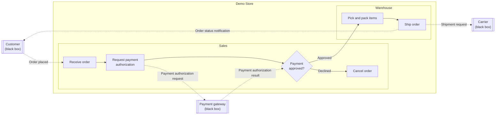
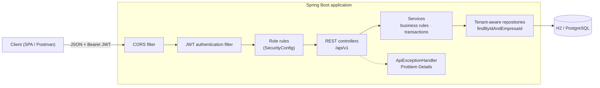
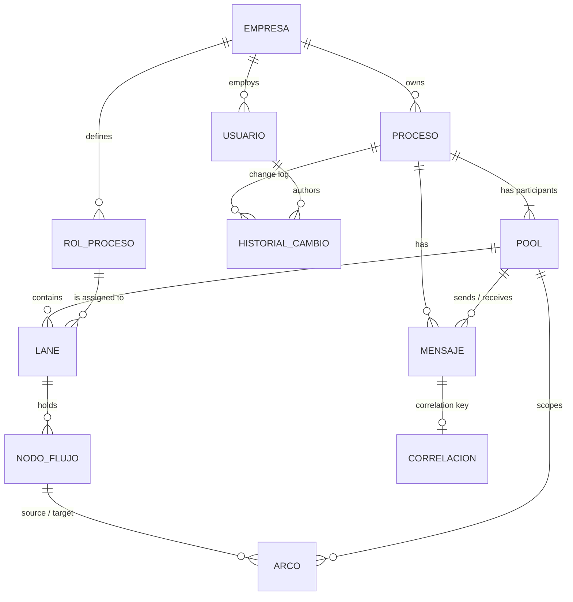

# BPMN Process Manager API

Multi-tenant backend for e-commerce operations. Online stores model, validate and share the workflows that keep
orders moving (order fulfillment, payments, returns) as BPMN processes, each store in its own isolated workspace.

[](https://github.com/AndresContreras1/bpmn-process-manager-api/actions/workflows/ci.yml)


> **Scope:** the API models and validates processes; it does not execute them. There are no running order
> instances, rule engines or calls to real payment gateways or carriers.

## Why e-commerce

A single online order crosses several teams and outside systems: the storefront, a payment gateway, the warehouse
and a carrier. When that flow only lives in people's heads, handoffs break: payments get captured for orders that
never ship, and returns stall between teams.

This API lets each store make those flows explicit:
- **who** does the work (lanes),
- **in which order** (sequence flows),
- **where decisions happen** (gateways),
- **which messages cross company boundaries** (message flows, correlated by `orderId`).

Isolation between stores, role-based access and a change history come built in.

| BPMN element | API resource | E-commerce example |
|---|---|---|
| Tenant | `Empresa` | An online store, such as *Demo Store* |
| Process | `Proceso` | *Order fulfillment*, *Returns and refunds* |
| Pool | `Pool` | Store, Customer, Payment gateway, Carrier |
| Lane | `Lane` + `RolProceso` | Sales, Warehouse |
| Activity | `Actividad` | Receive order, Pick and pack items, Ship order |
| Gateway | `Gateway` | Payment approved? |
| Sequence flow | `Arco` | Payment approved? → Pick and pack items, when `payment.status == APPROVED` |
| Message flow | `Mensaje` | Payment authorization request, from Store to Payment gateway |
| Correlation key | `Correlacion` | `orderId` |

## Demo: order fulfillment

On first start in the `dev` profile (the default), the API seeds **Demo Store** with two processes: a published
*Order fulfillment* process and a draft *Returns and refunds* process. The seed goes through the same services as the API,
so the demo data follows the same business rules. Log in as `admin@demo.com` / `admin123` and explore it from
Swagger UI.



Solid arrows are sequence flows inside the store's pool. Dotted arrows are message flows between participants, and
all of them are correlated by `orderId`.

## Highlights

- **Store isolation by design.** The tenant comes from the token, never from the request. Repositories are
  tenant-aware, and cross-store access answers `404`, which prevents IDOR.
- **Stateless JWT authentication** with a custom Spring Security filter chain and a typed `ApiPrincipal`.
- **Role-based authorization matrix** (administrator, editor, read-only), defined in one place in the security
  configuration.
- **RFC 9457 Problem Details** for every error, including `401` and `403` raised by the security layer, with a
  message for each invalid field. Fields that the contract does not define are rejected, not ignored.
- **Versioned REST contract** under `/api/v1`: `201 Created` with `Location`, `204 No Content`, `PATCH` for state
  transitions and a pagination envelope.
- **BPMN consistency rules**: sequence flows never cross pools, message flows only connect different participants,
  and a published process cannot go back to draft.
- **Schema under version control.** Flyway migrations shared by H2 and PostgreSQL, with engine-specific scripts where
  they differ. Hibernate only validates the schema, and the database enforces unique names on its own.
- **Architecture rules enforced by tests** with ArchUnit: layering, tenant isolation and no `HttpSession`.
- **248 automated tests** with 88 % line coverage, plus a GitHub Actions pipeline that builds, tests and packages a
  Docker image, then runs it against PostgreSQL.

## Tech stack

| Area | Technology |
|---|---|
| Language | Java 21 |
| Framework | Spring Boot 4.1 (Web MVC, Validation, Data JPA, Security 7) |
| Persistence | Hibernate 7.4 · Flyway 12 · H2 (`dev` and tests) · PostgreSQL (`prod`) |
| Security | JWT (jjwt 0.12.6, HS256) · BCrypt |
| API docs | springdoc-openapi 3 (OpenAPI 3 + Swagger UI) |
| Testing | JUnit 5 · Mockito · MockMvc · AssertJ · ArchUnit 1.4 · JaCoCo |
| Tooling | Maven Wrapper · Lombok · Docker · GitHub Actions · SonarCloud |

## Architecture



The code is split into two business modules. Each one is layered as controller → service → repository → model.

| Module | Responsibility |
|---|---|
| `security` | Filter chain, JWT issuing and validation, `ApiPrincipal`, 401/403 handlers, CORS |
| `common` | Tenant base entity, tenant-aware repository contract, business exceptions, Problem Details, pagination |
| `gestion` | Management: stores, users, processes, process roles and change history |
| `modelado` | BPMN modeling: pools, lanes, activities, gateways, sequence flows, message flows, correlation keys |

**Request lifecycle:**
1. The JWT filter validates the token and loads an `ApiPrincipal` (`usuarioId`, `empresaId`, role).
2. The role rules decide `401` or `403` before any controller runs.
3. Controllers receive the principal with `@AuthenticationPrincipal` and pass `empresaId` explicitly to the services.
4. Every lookup by id goes through `findByIdAndEmpresaId`, so a resource from another store does not exist for the
   caller.

## Domain model



The domain keeps the Spanish names of the original specification; the table in [Why e-commerce](#why-e-commerce)
maps each one to its BPMN meaning. More details:

- **Users** (`Usuario`) have an access role: `ADMINISTRADOR`, `EDITOR` or `SOLO_LECTURA`.
- **Processes** are `BORRADOR` (draft) or `PUBLICADO` (published).
- **Flow nodes** (`NodoFlujo`) use single-table inheritance: `Actividad` and `Gateway`. Gateways are `EXCLUSIVO`,
  `PARALELO` or `INCLUSIVO`.
- **Pools** have a participant type: `EMPRESA` (the store), `CLIENTE`, `PROVEEDOR` or `SISTEMA_EXTERNO`. A pool can
  be a black box, like a payment gateway whose internals the store does not model.
- **Every entity except `Empresa`** extends `EntidadEmpresa`, which holds a mandatory, non-updatable `empresa_id`.

**Business rules:**
- Sequence flows never cross pools.
- Messages only connect two different pools.
- A published process cannot go back to draft.
- Process and process-role names are unique among a store's active records, ignoring case; the database enforces it
  too. Flow-node names are unique within a process.
- A process role that is in use cannot be deleted.
- User emails are unique across the platform and case-insensitive: the email is the login, and the login
  does not know the store yet.
- Processes and process roles are soft-deleted, so they keep their traceability.

## Security model

1. `POST /api/v1/empresas` registers a store together with its first administrator.
2. `POST /api/v1/auth/login` returns an access token. Its claims are the email, `usuarioId`, `empresaId` and the
   role. It expires after 30 minutes by default and is signed with `JWT_SECRET`.
3. Clients send `Authorization: Bearer <token>`. The filter reloads the user on each request, so a deactivated user
   loses access immediately.

| Operation | `ADMINISTRADOR` | `EDITOR` | `SOLO_LECTURA` |
|---|:---:|:---:|:---:|
| Read processes, process roles and BPMN elements | ✅ | ✅ | ✅ |
| Create and update processes and BPMN elements | ✅ | ✅ | ❌ |
| Delete processes and BPMN elements | ✅ | ❌ | ❌ |
| Manage process roles | ✅ | ❌ | ❌ |
| Manage users | ✅ | ❌ | ❌ |

Public endpoints are limited to store registration, login, the API documentation (not published in `prod`) and, in
`dev`, the H2 console.

## Multi-tenancy and IDOR prevention

On a platform that hosts many stores, one store must never see another store's processes. The design enforces this
instead of relying on developers to remember a filter:

```java
@NoRepositoryBean
public interface RepositorioTenant<T extends EntidadEmpresa> extends JpaRepository<T, Long> {
    Optional<T> findByIdAndEmpresaId(Long id, Long empresaId);
    List<T> findAllByEmpresaId(Long empresaId);
    boolean existsByIdAndEmpresaId(Long id, Long empresaId);
}
```

- **Every tenant repository extends `RepositorioTenant`.** ArchUnit fails the build if a service calls the unfiltered
  `findById` or `findAll`.
- **Ids that arrive in a request body are resolved the same way.** A lane cannot point to another store's process
  role, and a sequence flow cannot connect another store's nodes.
- **No request DTO carries an `empresaId`.** This is an ArchUnit rule too: the client never chooses the tenant. A
  request body that still sends one is rejected with `400`.
- **Cross-store access answers `404`, not `403`,** so the API does not confirm that the resource exists.
- **An integration suite tests the tenant boundary.** It creates two stores and has one try to read, change or link
  the other's resources (48 cases).

## API overview

In `dev`, interactive documentation is available at `/swagger-ui.html` and the OpenAPI document at `/v3/api-docs`.
Every operation documents what it does, what it returns and the errors it can answer; a test fails the build when an
endpoint is left undocumented. The `prod` profile does not publish the documentation.

| Resource | Endpoints |
|---|---|
| Stores | `POST /api/v1/empresas` |
| Authentication | `POST /api/v1/auth/login` · `POST /api/v1/auth/logout` |
| Users | `GET, POST /api/v1/usuarios` · `GET, PATCH, DELETE /api/v1/usuarios/{id}` |
| Processes | `GET, POST /api/v1/procesos` · `GET, PUT, PATCH, DELETE /api/v1/procesos/{id}` · `GET /api/v1/procesos/{id}/historial` |
| Process roles | `GET, POST /api/v1/roles` · `GET, PUT, DELETE /api/v1/roles/{id}` |
| Pools | `GET, POST /api/v1/procesos/{procesoId}/pools` · `GET, PUT, DELETE /api/v1/pools/{id}` |
| Lanes | `GET, POST /api/v1/pools/{poolId}/lanes` · `GET, PUT, DELETE /api/v1/lanes/{id}` |
| Activities | `GET, POST /api/v1/lanes/{laneId}/actividades` · `GET, PUT, DELETE /api/v1/actividades/{id}` |
| Gateways | `GET, POST /api/v1/lanes/{laneId}/gateways` · `GET, PUT, DELETE /api/v1/gateways/{id}` |
| Sequence flows | `POST /api/v1/arcos` · `GET /api/v1/pools/{poolId}/arcos` · `GET, PUT, DELETE /api/v1/arcos/{id}` |
| Message flows | `GET, POST /api/v1/procesos/{procesoId}/mensajes` · `GET, PUT, DELETE /api/v1/mensajes/{id}` |
| Correlation keys | `GET, PUT /api/v1/mensajes/{mensajeId}/correlacion` |

The process list accepts `nombre`, `estado`, `categoria` and `pagina`, and returns a pagination envelope:

```json
{ "content": [ ... ], "page": 0, "size": 10, "totalElements": 2, "totalPages": 1 }
```

State transitions use `PATCH`, for example `PATCH /api/v1/procesos/42` with `{ "estado": "PUBLICADO" }`.

Errors follow RFC 9457:

```json
{
  "title": "Recurso no encontrado",
  "status": 404,
  "detail": "Proceso no encontrado.",
  "instance": "/api/v1/procesos/99"
}
```

A `400` that points at specific fields adds an `errors` map, so a client can show each message next to its field. It
covers failed validations, values of the wrong type (for enums, the message lists the valid values) and fields the
operation does not accept:

```json
{
  "title": "Validación fallida",
  "status": 400,
  "detail": "Uno o más campos no son válidos.",
  "instance": "/api/v1/procesos",
  "errors": {
    "categoria": "La categoria es obligatoria.",
    "nombre": "El nombre es obligatorio."
  }
}
```

Every `401` carries `WWW-Authenticate: Bearer`.

## Getting started

**Requirements:** JDK 21, or Docker.

```bash
./mvnw spring-boot:run
```

The API starts on `http://localhost:8080` in the `dev` profile: a file-based H2 database under `./data`, seeded with
Demo Store. The H2 console is at `/h2-console` (JDBC URL `jdbc:h2:file:./data/procesos`, user `sa`, no password). If
`JWT_SECRET` is not set, a random signing key is generated, so tokens become invalid after a restart.

> **Upgrading from a version before Flyway?** Delete `./data` once. Flyway builds the schema on the next start and does
> not adopt a schema that Hibernate created.

| Profile | Activated by | Database | Demo Store | H2 console | OpenAPI and Swagger UI | SQL log |
|---|---|---|:---:|:---:|:---:|:---:|
| `dev` | Default, when no profile is set | H2 file under `./data` | ✅ | ✅ | ✅ | ✅ |
| `test` | `@ActiveProfiles("test")` in integration tests | In-memory H2, a new one for each Spring test context | ❌ | ❌ | ✅ | ❌ |
| `prod` | `SPRING_PROFILES_ACTIVE=prod` | PostgreSQL | ❌ | ❌ | ❌ | ❌ |

**Quick tour:**

```bash
# 1. Log in as the Demo Store administrator (requires jq)
TOKEN=$(curl -s -X POST http://localhost:8080/api/v1/auth/login -H "Content-Type: application/json" \
  -d '{"email":"admin@demo.com","password":"admin123"}' | jq -r .accessToken)

# 2. List the store's processes: Order fulfillment (published) and Returns and refunds (draft)
curl -s http://localhost:8080/api/v1/procesos -H "Authorization: Bearer $TOKEN"

# 3. Explore a process: participants, then the messages exchanged with them
curl -s http://localhost:8080/api/v1/procesos/{id}/pools -H "Authorization: Bearer $TOKEN"
curl -s http://localhost:8080/api/v1/procesos/{id}/mensajes -H "Authorization: Bearer $TOKEN"

# 4. Register your own store: its processes are invisible to Demo Store, and the other way around
curl -s -X POST http://localhost:8080/api/v1/empresas -H "Content-Type: application/json" \
  -d '{"nombreEmpresa":"Acme Store","nit":"901234567-8","correoContacto":"contact@acme.com","nombreAdmin":"Ana","emailAdmin":"ana@acme.com","passwordAdmin":"secret123"}'
```

The [Postman collection](postman/) walks through a second scenario: *Acme Store* models how it hands orders over to a
third-party logistics (3PL) partner. Run its requests in order.

### Docker

```bash
docker build -t bpmn-process-manager-api .
docker run -p 8080:8080 \
  -e JWT_SECRET=<at-least-32-random-characters> \
  -e SPRING_DATASOURCE_URL=jdbc:h2:mem:procesos \
  bpmn-process-manager-api
```

The image is a multi-stage build that runs as a non-root user. This command starts the `dev` profile on an in-memory
database, with Demo Store; for persistent data, use the `prod` profile with PostgreSQL.

### PostgreSQL (`prod` profile)

| Variable | Purpose | Default |
|---|---|---|
| `SPRING_PROFILES_ACTIVE` | Set to `prod` to use PostgreSQL; the demo store and the API documentation are left out | `dev` |
| `DB_HOST` · `DB_PORT` · `DB_NAME` | Database location | `localhost` · `5432` · `procesos` |
| `DB_USER` · `DB_PASSWORD` | Database credentials | `procesos` · empty |
| `JWT_SECRET` | HS256 signing key, at least 32 bytes; in `prod` the application does not start without it | none |
| `JWT_EXPIRATION_SECONDS` | Access token lifetime | `1800` |
| `CORS_ALLOWED_ORIGINS` | Allowed storefront or back-office origins | `http://localhost:4200` |

On startup, Flyway creates the schema or brings it up to date, so the database must exist and the user needs
permission to create tables. The CI pipeline starts the image in this profile against PostgreSQL 16.

## Testing

```bash
./mvnw verify
```

The build runs 248 tests and a JaCoCo coverage check. The HTML report is written to `target/site/jacoco/index.html`.

| Suite | Tests | What it covers |
|---|---:|---|
| Architecture (ArchUnit) | 21 | Layering, packaging, tenant isolation, JPA inheritance, no `HttpSession`, a declared profile in every `@SpringBootTest` |
| Controller slices (`@WebMvcTest`) | 95 | Routes, status codes, JSON shape and validation, with the real security rules |
| Service unit tests (Mockito) | 22 | Business rules of the management module |
| Security and isolation (`@SpringBootTest`) | 95 | Two-store IDOR suite, role matrix, JWT tampering and expiry, end-to-end 401/403 |
| Profiles, schema, API contract and demo data (`@SpringBootTest`) | 13 | What `dev` and `prod` expose, the Flyway migrations and the unique indexes, an OpenAPI contract with no undocumented endpoint, and the seeded order fulfillment process read through the API |
| Application context | 2 | The full context starts in the `test` profile, with an empty database |

Current coverage: 88 % of lines and 63 % of branches.

## Project structure

```text
src/main/java/com/facimus/procesos
├── common/        tenant base entity, tenant-aware repository, business exceptions
│   └── api/       ApiExceptionHandler (Problem Details), PageResponse
├── config/        OpenAPI definition, demo store seed (dev profile)
├── security/      SecurityConfig, JWT service and filter, ApiPrincipal, 401/403 handlers, CORS
├── gestion/       management module: controller (+ dto) · service · repository · model
└── modelado/      BPMN modeling module: controller (+ dto) · service · repository · model

src/main/resources
├── application*.properties   shared settings and the dev and prod profiles
└── db/migration/             Flyway: common/ runs on every engine; h2/ and postgresql/ hold engine-specific SQL

src/test/java/com/facimus/procesos
├── arquitectura/  ArchUnit rules
├── config/        profiles, migrations, the OpenAPI contract, and the demo data read through the API
├── gestion/       controller slices and service unit tests
├── modelado/      controller slices
└── security/      JWT, role matrix and two-tenant isolation tests
```

## Design decisions

- **`404` instead of `403` across stores.** Answering "forbidden" would confirm that another store's resource exists.
- **The tenant comes only from the token.** Request DTOs cannot carry an `empresaId`, and ArchUnit enforces it.
- **The user is reloaded on every request.** Deactivating an employee takes effect immediately, at the cost of one
  indexed query per request. Pure claim-based tokens would need a short lifetime plus refresh tokens instead.
- **Single-table inheritance for flow nodes.** Activities and gateways share one table and one identity, so sequence
  flows can point to either of them.
- **Soft delete for processes and process roles.** They keep their history, and deleted resources answer `404`.
- **One error format.** Validation, business and security errors all return Problem Details, so clients handle a
  single shape.
- **Unknown fields are errors.** Jackson fails on properties the contract does not define, so a typo or a smuggled
  `empresaId` gets a `400` instead of being silently dropped.
- **The demo data goes through the services.** The seed cannot create a diagram that the API itself would reject.
- **The schema belongs to Flyway.** Migrations are the single source of truth and Hibernate only validates them
  (`ddl-auto=validate`). Portable SQL lives in `db/migration/common`; what only one engine can express, such as
  PostgreSQL's partial unique indexes, lives in `db/migration/{vendor}`, and H2 gets an equivalent built on a
  generated column.
- **Every text column has a length, and so does its request field.** A value that is too long answers `400` before it
  reaches the database. Passwords stop at 72 characters: BCrypt only reads 72 bytes, and Spring Security
  rejects longer ones.
- **Tests never touch the development database.** Every `@SpringBootTest` declares its profile (an ArchUnit rule checks
  it), and the `test` profile gives each Spring context its own in-memory database, so tests create the data they need.

## Roadmap

**Peak-traffic readiness**
- [ ] k6 load tests that simulate a sales peak, with thresholds in CI
- [ ] Connection-pool and thread-pool sizing based on those measurements
- [ ] Second-level cache for published processes, which are read often and change rarely
- [ ] `Pageable`-based pagination with stable sorting for every collection that can grow

**Consistency under concurrency**
- [ ] Optimistic locking with `@Version`, so two editors cannot overwrite each other (`409 Conflict`)
- [ ] Idempotency keys on create requests, so a retried call does not duplicate a process
- [ ] Process versioning: editing a published process opens a new draft version

**Security**
- [x] Enforce globally unique user emails, so a new store cannot reuse an existing user's login email
- [ ] Authenticate through `AuthenticationManager` + `UserDetailsService`, without revealing whether an email exists
- [ ] Short-lived access tokens with refresh tokens
- [ ] Rate limiting on login (`429` + `Retry-After`)

**Data and auditability**
- [x] Flyway migrations with `ddl-auto=validate`, composite unique constraints and `empresa_id` indexes
- [ ] Soft delete and change history for every BPMN element
- [ ] Auditing fields (`createdBy`, `lastModifiedBy`) filled from the authenticated principal
- [ ] Lazy associations with entity graphs and read-only transactions

**API contract**
- [x] Full OpenAPI documentation (`@Tag`, `@Operation`, `@ApiResponse`, `@Schema`), with Swagger UI disabled in production
- [x] Field-level validation errors in Problem Details
- [ ] Aggregate endpoint that returns a complete BPMN diagram for the back-office front end

**Architecture and quality**
- [ ] Request/response DTO packages with MapStruct mappers; services exposed as interfaces
- [ ] Module boundaries between `gestion` and `modelado` enforced by ArchUnit (no dependency cycles)
- [x] Complete Spring profiles: `dev` with seed data, `test` with an isolated in-memory database, `prod`
- [ ] Repository tests with `@DataJpaTest` and unit tests for every modeling service
- [ ] Coverage gate per package (services ≥ 70 %, branches included) and a SonarCloud quality gate
- [ ] Docker Compose with PostgreSQL, Actuator health checks and Testcontainers-based integration tests

## Credits

This project began as a five-person team project for the Web Development course of my Systems Engineering degree. It
was built in the team repository [Facimus-Curiositatem/Beta-back](https://github.com/Facimus-Curiositatem/Beta-back),
and the first commit here is a snapshot of that repository.

My contributions to the team version:

- **Stateless security:** the Spring Security filter chain, JWT issuing and validation, `ApiPrincipal`, Problem Details
  responses for `401`/`403`, and CORS.
- **Multi-tenancy and authorization:** tenant checks on every lookup, including listings by parent resource and ids
  received in request bodies; the cross-tenant `404` policy (IDOR prevention); the centralized role matrix; the
  ArchUnit isolation rules; and the two-company integration suite.

This repository is my personal continuation of the project. It evolves independently from the team version: it is
now oriented to e-commerce operations and follows the roadmap above.
