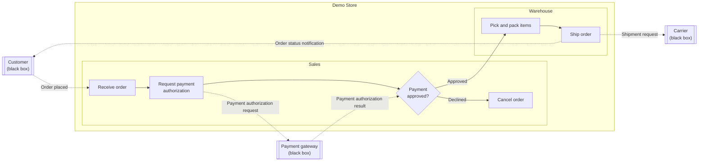
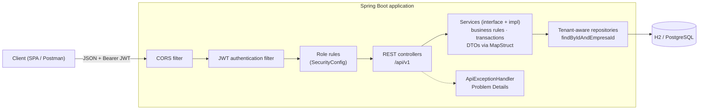
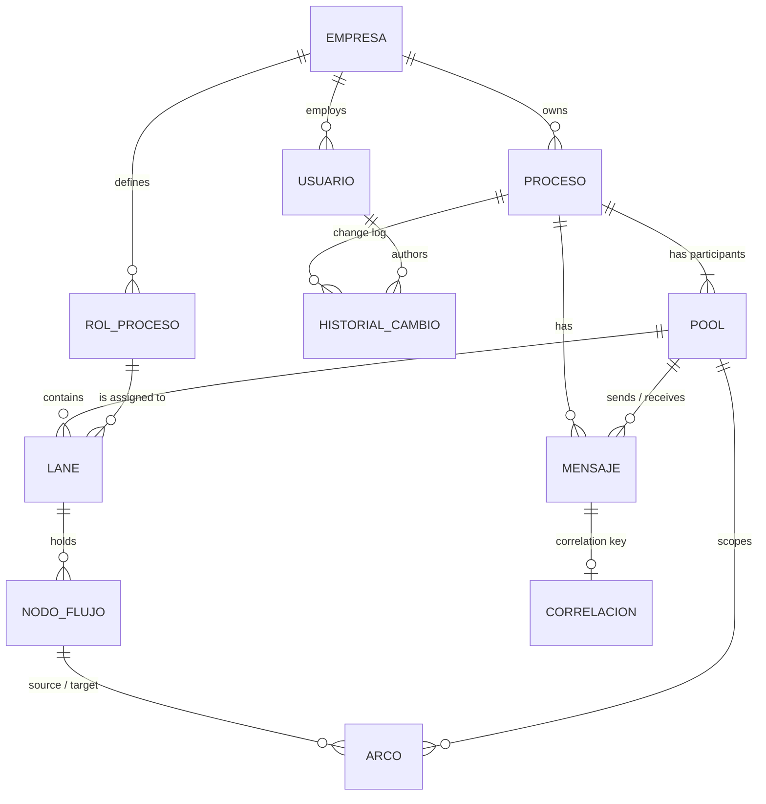

# BPMN Process Manager API

Multi-tenant backend for e-commerce operations. Online stores model, validate and share the workflows that keep
orders moving (order fulfillment, payments, returns) as BPMN processes, each store in its own isolated workspace.

[](https://github.com/AndresContreras1/bpmn-process-manager-api/actions/workflows/ci.yml)


> **Scope:** the API models and validates processes; it does not execute them. There are no running order
> instances, rule engines or calls to real payment gateways or carriers.

## Why e-commerce

A single online order crosses several teams and outside systems: the storefront, a payment gateway, the warehouse
and a carrier. When that flow only lives in people's heads, handoffs break: payments get captured for orders that
never ship, and returns stall between teams.

This API lets each store make those flows explicit:
- **who** does the work (lanes),
- **in which order** (sequence flows),
- **where decisions happen** (gateways),
- **which messages cross company boundaries** (message flows, correlated by `orderId`).

Isolation between stores, role-based access and a change history come built in.

| BPMN element | API resource | E-commerce example |
|---|---|---|
| Tenant | `Empresa` | An online store, such as *Demo Store* |
| Process | `Proceso` | *Order fulfillment*, *Returns and refunds* |
| Pool | `Pool` | Store, Customer, Payment gateway, Carrier |
| Lane | `Lane` + `RolProceso` | Sales, Warehouse |
| Activity | `Actividad` | Receive order, Pick and pack items, Ship order |
| Gateway | `Gateway` | Payment approved? |
| Sequence flow | `Arco` | Payment approved? → Pick and pack items, when `payment.status == APPROVED` |
| Message flow | `Mensaje` | Payment authorization request, from Store to Payment gateway |
| Correlation key | `Correlacion` | `orderId` |

## Demo: order fulfillment

On first start in the `dev` profile (the default), the API seeds **Demo Store** with two processes: a published
*Order fulfillment* process and a draft *Returns and refunds* process. The seed goes through the same services as the API,
so the demo data follows the same business rules. Log in as `admin@demo.com` / `admin123` and explore it from
Swagger UI.



Solid arrows are sequence flows inside the store's pool. Dotted arrows are message flows between participants, and
all of them are correlated by `orderId`.

## Highlights

- **Store isolation by design.** The tenant comes from the token, never from the request. Repositories are
  tenant-aware, and cross-store access answers `404`, which prevents IDOR. The one declared exception, read-only
  process sharing (HU-23), goes through a separate read door that no change can use.
- **Short-lived JWT access tokens and single-use refresh tokens.** The login goes through Spring Security's
  `AuthenticationManager`, the filter authenticates from the token's claims without a query, a reused refresh token
  closes its session, and failed logins are rate-limited with `429` and `Retry-After`.
- **Role-based authorization matrix** (administrator, editor, read-only), defined in one place in the security
  configuration. A store always keeps an active administrator, even when two administrators change their roles at the
  same moment.
- **RFC 9457 Problem Details** for every error, including `401` and `403` raised by the security layer and the `400`
  for URLs its firewall rejects, with a message for each invalid field. Fields that the contract does not define are
  rejected, not ignored.
- **Versioned REST contract** under `/api/v1`: `201 Created` with a `Location` that resolves, `204 No Content`,
  `PATCH` for state transitions, and paged lists with an allowlisted sort and a stable order.
- **Safe under concurrency and retries.** Every edit sends the `version` it read and answers `409` if someone saved a
  change since, instead of overwriting it. A create retried with the same `Idempotency-Key` gets the first response
  back instead of a duplicate. Every editable resource records who created it and who changed it last, and when.
- **BPMN consistency rules**, checked on every create and every edit: sequence flows never cross pools, message
  flows only connect participants of their own process, the flows that leave an exclusive or inclusive gateway carry
  its conditions, node names are unique within a process, and a published process cannot go back to draft.
- **Schema under version control.** Flyway migrations shared by H2 and PostgreSQL, with engine-specific scripts where
  they differ. Hibernate only validates the schema, and the database enforces unique names on its own.
- **Layered modules with a one-way dependency.** Services are interfaces that return DTOs mapped with MapStruct
  inside read-only transactions. `modelado` builds on `gestion`, never the reverse: a domain event and a port
  replace the calls that used to go the other way.
- **Architecture rules enforced by tests** with ArchUnit: layering, module boundaries, no package cycles, lazy
  associations, tenant isolation and no `HttpSession`.
- **392 automated tests** with 95 % line coverage, plus a GitHub Actions pipeline that builds, tests and packages a
  Docker image, then runs it against PostgreSQL.

## Tech stack

| Area | Technology |
|---|---|
| Language | Java 21 |
| Framework | Spring Boot 4.1 (Web MVC, Validation, Data JPA, Security 7) |
| Persistence | Hibernate 7.4 · Flyway 12 · H2 (`dev` and tests) · PostgreSQL (`prod`) |
| Security | Spring Security `AuthenticationManager` · JWT (jjwt 0.12.6, HS256) · BCrypt · SHA-256-hashed refresh tokens |
| API docs | springdoc-openapi 3 (OpenAPI 3 + Swagger UI) |
| Testing | JUnit 5 · Mockito · MockMvc · AssertJ · ArchUnit 1.4 · JaCoCo |
| Tooling | Maven Wrapper · Lombok · MapStruct · Docker · GitHub Actions · SonarCloud |

## Architecture



The code is split into two business modules. Each one is layered as controller → service (interface) → service
implementation → repository → model, with `dto` for the module's contract and `mapper` for the MapStruct
translations.

| Module | Responsibility |
|---|---|
| `security` | Filter chain, login and its rate limit, JWT issuing and validation, closed sessions, `ApiPrincipal`, 401/403 handlers, CORS |
| `common` | Tenant base entity, tenant-aware repository contract, business exceptions, Problem Details, pagination |
| `gestion` | Management: stores, users and their sessions, processes, process roles and change history |
| `modelado` | BPMN modeling: pools, lanes, activities, gateways, sequence flows, message flows, correlation keys |

**Request lifecycle:**
1. The JWT filter validates the token and builds an `ApiPrincipal` (`usuarioId`, `empresaId`, role, session) from its
   claims, without a database query. A token whose session was closed is rejected.
2. The role rules decide `401` or `403` before any controller runs.
3. Controllers receive the principal with `@AuthenticationPrincipal` and pass `empresaId` explicitly to the services.
4. Every lookup by id goes through `findByIdAndEmpresaId`, so a resource from another store does not exist for the
   caller.
5. The service maps the result to a DTO inside its transaction: entities never reach the controller.

**Module boundaries.** `modelado` builds on the processes and roles of `gestion`, so `gestion` never depends on
`modelado`. When a process is created, `gestion` publishes a `ProcesoCreado` event and `modelado` creates the store's
pool in the same transaction. To know whether a process role is in use, `gestion` asks the `UsoDeRoles` port, which
`modelado` implements on top of its lanes.

## Domain model



The domain keeps the Spanish names of the original specification; the table in [Why e-commerce](#why-e-commerce)
maps each one to its BPMN meaning. More details:

- **Users** (`Usuario`) have an access role: `ADMINISTRADOR`, `EDITOR` or `SOLO_LECTURA`.
- **Processes** are `BORRADOR` (draft) or `PUBLICADO` (published).
- **Flow nodes** (`NodoFlujo`) use single-table inheritance: `Actividad` and `Gateway`. Gateways are `EXCLUSIVO`,
  `PARALELO` or `INCLUSIVO`.
- **Pools** have a participant type: `EMPRESA` (the store), `CLIENTE`, `PROVEEDOR` or `SISTEMA_EXTERNO`. A pool can
  be a black box, like a payment gateway whose internals the store does not model.
- **Every entity except `Empresa`** extends `EntidadEmpresa`, which holds a mandatory, non-updatable `empresa_id`.

**Business rules:**
- Sequence flows never cross pools.
- A sequence flow that leaves an exclusive or inclusive gateway carries a condition, because the gateway picks its
  path by those conditions; the flows that enter the gateway need none. A gateway only becomes exclusive or inclusive
  when every flow that leaves it has a condition.
- Message flows only connect two different pools, and both have to be participants of the message's process.
- A published process cannot go back to draft.
- Process and process-role names are unique among a store's active records, ignoring case; the database enforces it
  too. Flow-node names are unique within a process, also when a node is renamed.
- A process role that an active process uses cannot be deleted.
- User emails are unique across the platform and case-insensitive: the email is the login, and the login
  does not know the store yet.
- A store always keeps an active administrator: the last one cannot give up the role, and nobody can deactivate their
  own account. When two administrators remove each other's role at the same moment, the second change waits on a lock
  of the store's row, sees the first one and is refused with `409`.
- Everything is soft-deleted, from processes and process roles to every BPMN element, so it keeps its
  traceability: a deleted resource answers `404` but stays in the database. Deleting a pool retires the message flows
  that enter or leave it, and deleting a process (HU-06) retires its whole model.
- Every change to a process or its model lands in the process history with its author, from creating a pool to
  editing an activity or deleting a sequence flow.

## Security model

1. `POST /api/v1/empresas` registers a store together with its first administrator.
2. `POST /api/v1/auth/login` checks the credentials through Spring Security's `AuthenticationManager` and opens a
   session with two tokens:
   - The **access token** is a JWT signed with `JWT_SECRET` that expires after 15 minutes. Its claims are the email,
     `usuarioId`, `empresaId`, the role and the session (`sid`).
   - The **refresh token** is 256 random bits. The database stores only its SHA-256 hash, so a copy of the database
     cannot open a session.
3. Clients send `Authorization: Bearer <access token>`. The filter builds the principal from the claims, without a
   database query, and rejects the tokens of a closed session.
4. `POST /api/v1/auth/refresh` trades the refresh token for a new pair of the same session. Each refresh token works
   once: sending one that was already used means a copy is going around, so the whole session is closed.
5. `POST /api/v1/auth/logout` closes the session. Deactivating a user or changing their role closes every session
   they have, so the old role stops working at once and the user logs in again.

| Operation | `ADMINISTRADOR` | `EDITOR` | `SOLO_LECTURA` |
|---|:---:|:---:|:---:|
| Read processes, process roles and BPMN elements | ✅ | ✅ | ✅ |
| Create and update processes and BPMN elements | ✅ | ✅ | ❌ |
| Delete processes and BPMN elements | ✅ | ❌ | ❌ |
| Manage process roles | ✅ | ❌ | ❌ |
| Manage users | ✅ | ❌ | ❌ |
| Share a process with another store (HU-23) | ✅ | ❌ | ❌ |

Public endpoints are limited to store registration, login, token renewal, the API documentation (not published in
`prod`) and, in `dev`, the H2 console.

**Login protection.** An unknown email, a deactivated user and a wrong password get the same `401`, and
`DaoAuthenticationProvider` spends the time of a BCrypt comparison even when the email does not exist. After 5 failed
attempts for an email from the same address within 15 minutes, the login answers `429` with `Retry-After` and stops
checking passwords until the oldest attempt leaves the window. Counting per email and address means an attacker
elsewhere cannot lock the real user out.

**One instance.** Closed sessions and failed attempts live in memory, and closed sessions are reloaded from the
database on startup. With several instances, both would move to a shared store such as Redis.

## Multi-tenancy and IDOR prevention

On a platform that hosts many stores, one store must never see another store's processes. The design enforces this
instead of relying on developers to remember a filter:

```java
@NoRepositoryBean
public interface RepositorioTenant<T extends EntidadEmpresa> extends JpaRepository<T, Long> {
    Optional<T> findByIdAndEmpresaId(Long id, Long empresaId);
    List<T> findAllByEmpresaId(Long empresaId);
    boolean existsByIdAndEmpresaId(Long id, Long empresaId);
}
```

- **Every tenant repository extends `RepositorioTenant`.** ArchUnit fails the build if a service calls the unfiltered
  `findById` or `findAll`.
- **Ids that arrive in a request body are resolved the same way.** A lane cannot point to another store's process
  role, and a sequence flow cannot connect another store's nodes.
- **No request DTO carries an `empresaId`.** This is an ArchUnit rule too: the client never chooses the tenant. A
  request body that still sends one is rejected with `400`.
- **Cross-store access answers `404`, not `403`,** so the API does not confirm that the resource exists.
- **An integration suite tests the tenant boundary.** It creates two stores and has one try to read, change or link
  the other's resources (50 cases).

**The one declared exception: read-only sharing (HU-23).** A store's administrator can share a process with another
store by its NIT. A process then has two doors: the write door finds only the store's own processes, and the read door
also finds the ones shared with it. The whole diagram is the only endpoint behind the read door, marked
`compartido: true` for the guest. The detail, the history and every modeling endpoint stay private to the owner, and
any change from the guest answers `404`. The guest lists what it received in `GET /api/v1/procesos/compartidos-conmigo`,
and the owner's process history records when a process was shared and when it stopped.

## API overview

In `dev`, interactive documentation is available at `/swagger-ui.html` and the OpenAPI document at `/v3/api-docs`.
Every operation documents what it does, what it returns and the errors it can answer; a test fails the build when an
endpoint is left undocumented. The `prod` profile does not publish the documentation.

| Resource | Endpoints |
|---|---|
| Stores | `POST /api/v1/empresas` · `GET /api/v1/empresas/actual` · `GET /api/v1/empresas/{id}` |
| Authentication | `POST /api/v1/auth/login` · `POST /api/v1/auth/refresh` · `POST /api/v1/auth/logout` |
| Users | `GET, POST /api/v1/usuarios` · `GET, PATCH, DELETE /api/v1/usuarios/{id}` |
| Processes | `GET, POST /api/v1/procesos` · `GET, PUT, PATCH, DELETE /api/v1/procesos/{id}` · `GET /api/v1/procesos/{id}/historial` |
| Process roles | `GET, POST /api/v1/roles` · `GET, PUT, DELETE /api/v1/roles/{id}` |
| Pools | `GET, POST /api/v1/procesos/{procesoId}/pools` · `GET, PUT, DELETE /api/v1/pools/{id}` |
| Lanes | `GET, POST /api/v1/pools/{poolId}/lanes` · `GET, PUT, DELETE /api/v1/lanes/{id}` |
| Activities | `GET, POST /api/v1/lanes/{laneId}/actividades` · `GET, PUT, DELETE /api/v1/actividades/{id}` |
| Gateways | `GET, POST /api/v1/lanes/{laneId}/gateways` · `GET, PUT, DELETE /api/v1/gateways/{id}` |
| Sequence flows | `POST /api/v1/arcos` · `GET /api/v1/pools/{poolId}/arcos` · `GET, PUT, DELETE /api/v1/arcos/{id}` |
| Message flows | `GET, POST /api/v1/procesos/{procesoId}/mensajes` · `GET, PUT, DELETE /api/v1/mensajes/{id}` |
| Correlation keys | `GET, PUT /api/v1/mensajes/{mensajeId}/correlacion` |
| Whole diagram | `GET /api/v1/procesos/{id}/diagrama` |
| Process sharing | `GET, POST /api/v1/procesos/{id}/compartidos` · `GET, DELETE /api/v1/procesos/{id}/compartidos/{empresaInvitadaId}` · `GET /api/v1/procesos/compartidos-conmigo` |

`GET /api/v1/procesos/{id}/diagrama` returns everything a client needs to draw a process in one response: the
process and flat lists of pools, lanes, activities, gateways, sequence flows, message flows and correlation keys,
linked by id. It takes one query per element type, however large the diagram grows.

Lists that can grow (processes, process roles, users and shared processes) take `pagina`, `tamano` (1 to 50, 10 by
default) and `orden`, a field from each list's allowlist with `asc` or `desc`, such as `orden=nombre,asc`. The id breaks
ties, so no row repeats or goes missing between pages. Processes also filter by `nombre`, `estado` and `categoria`, and
process roles by `nombre` (HU-20). They all answer the same envelope:

```json
{ "content": [ ... ], "page": 0, "size": 10, "totalElements": 2, "totalPages": 1 }
```

State transitions use `PATCH`, for example `PATCH /api/v1/procesos/42` with `{ "estado": "PUBLICADO", "version": 3 }`.

**Concurrent edits (optimistic locking).** Every editable resource answers a `version` that goes up with each saved
change. A `PUT` or `PATCH` sends back the version it read; if someone saved a change since, it answers `409` and
changes nothing, so the client reloads and decides again. If two edits of the same version arrive at once, both pass
that check and the database rejects the second through JPA's `@Version`. The correlation key of a message is the one
upsert: the first one is created without a version.

**Retries (idempotency keys).** An authenticated `POST` accepts an `Idempotency-Key` header, any unique value such as
a UUID. A retry with the same key gets the first response back, marked with `Idempotent-Replayed: true`, instead of
creating the resource again. The same key with another request answers `422`, and while the first one is still
running, `409`. Only successful responses are kept, so after an error the client can fix the request and retry with
the same key. Keys belong to each user.

**Auditing.** Every editable resource answers `creadoPor`, `fechaCreacion`, `modificadoPor` and `fechaModificacion`,
filled by Spring Data auditing from the authenticated user. What the system creates without a token, such as the
first administrator of a store, has no author.

Errors follow RFC 9457:

```json
{
  "title": "Recurso no encontrado",
  "status": 404,
  "detail": "Proceso no encontrado.",
  "instance": "/api/v1/procesos/99"
}
```

A `400` that points at specific fields adds an `errors` map, so a client can show each message next to its field. It
covers failed validations, values of the wrong type (for enums, the message lists the valid values) and fields the
operation does not accept:

```json
{
  "title": "Validación fallida",
  "status": 400,
  "detail": "Uno o más campos no son válidos.",
  "instance": "/api/v1/procesos",
  "errors": {
    "categoria": "La categoria es obligatoria.",
    "nombre": "El nombre es obligatorio."
  }
}
```

Every `401` carries `WWW-Authenticate: Bearer`.

## Getting started

**Requirements:** JDK 21, or Docker.

```bash
./mvnw spring-boot:run
```

The API starts on `http://localhost:8080` in the `dev` profile: a file-based H2 database under `./data`, seeded with
Demo Store. The H2 console is at `/h2-console` (JDBC URL `jdbc:h2:file:./data/procesos`, user `sa`, no password). If
`JWT_SECRET` is not set, a random signing key is generated, so access tokens become invalid after a restart; the
refresh token, which lives in the database, still renews them.

> **Upgrading from a version before Flyway?** Delete `./data` once. Flyway builds the schema on the next start and does
> not adopt a schema that Hibernate created.

| Profile | Activated by | Database | Demo Store | H2 console | OpenAPI and Swagger UI | SQL log |
|---|---|---|:---:|:---:|:---:|:---:|
| `dev` | Default, when no profile is set | H2 file under `./data` | ✅ | ✅ | ✅ | ✅ |
| `test` | `@ActiveProfiles("test")` in integration tests | In-memory H2, a new one for each Spring test context | ❌ | ❌ | ✅ | ❌ |
| `prod` | `SPRING_PROFILES_ACTIVE=prod` | PostgreSQL | ❌ | ❌ | ❌ | ❌ |

**Quick tour:**

```bash
# 1. Log in as the Demo Store administrator (requires jq)
TOKEN=$(curl -s -X POST http://localhost:8080/api/v1/auth/login -H "Content-Type: application/json" \
  -d '{"email":"admin@demo.com","password":"admin123"}' | jq -r .accessToken)

# 2. List the store's processes: Order fulfillment (published) and Returns and refunds (draft)
curl -s http://localhost:8080/api/v1/procesos -H "Authorization: Bearer $TOKEN"

# 3. Explore a process: participants, lanes, steps, flows and messages in one call
curl -s http://localhost:8080/api/v1/procesos/{id}/diagrama -H "Authorization: Bearer $TOKEN"

# 4. Register your own store: its processes are invisible to Demo Store, and the other way around
curl -s -X POST http://localhost:8080/api/v1/empresas -H "Content-Type: application/json" \
  -d '{"nombreEmpresa":"Acme Store","nit":"901234567-8","correoContacto":"contact@acme.com","nombreAdmin":"Ana","emailAdmin":"ana@acme.com","passwordAdmin":"secret123"}'
```

The login also returns a `refreshToken`. Before the access token expires, trade it for a new pair with
`POST /api/v1/auth/refresh` and the body `{"refreshToken": "..."}`.

The [Postman collection](postman/) walks through a second scenario: *Acme Store* models how it hands orders over to a
third-party logistics (3PL) partner. Run its requests in order, one by one or with the Collection Runner: the last
folder deletes what the scenario created, children first.

### Docker

```bash
docker build -t bpmn-process-manager-api .
docker run -p 8080:8080 \
  -e JWT_SECRET=<at-least-32-random-characters> \
  -e SPRING_DATASOURCE_URL=jdbc:h2:mem:procesos \
  bpmn-process-manager-api
```

The image is a multi-stage build that runs as a non-root user. This command starts the `dev` profile on an in-memory
database, with Demo Store; for persistent data, use the `prod` profile with PostgreSQL.

### PostgreSQL (`prod` profile)

| Variable | Purpose | Default |
|---|---|---|
| `SPRING_PROFILES_ACTIVE` | Set to `prod` to use PostgreSQL; the demo store and the API documentation are left out | `dev` |
| `DB_HOST` · `DB_PORT` · `DB_NAME` | Database location | `localhost` · `5432` · `procesos` |
| `DB_USER` · `DB_PASSWORD` | Database credentials | `procesos` · empty |
| `JWT_SECRET` | HS256 signing key, at least 32 bytes; in `prod` the application does not start without it | none |
| `JWT_EXPIRATION_SECONDS` | Access token lifetime | `900` |
| `JWT_REFRESH_EXPIRATION_SECONDS` | Refresh token lifetime; every renewal issues a new one | `604800` (7 days) |
| `LOGIN_MAX_FAILED_ATTEMPTS` · `LOGIN_FAILED_ATTEMPTS_WINDOW` | Failed logins of an email from one address that answer `429`, and the window that counts them | `5` · `15m` |
| `CORS_ALLOWED_ORIGINS` | Allowed storefront or back-office origins | `http://localhost:4200` |

On startup, Flyway creates the schema or brings it up to date, so the database must exist and the user needs
permission to create tables. The CI pipeline starts the image in this profile against PostgreSQL 16.

## Frontend

[`frontend/`](frontend/) holds an Angular 19 single-page app that presents the API: a store signs in, manages its
processes and views their BPMN diagrams. It uses Bootstrap 5 and talks to the backend through services that return
observables.

```bash
cd frontend
npm ci
npm start
```

It opens on http://localhost:4200, and the Angular dev server forwards the `/api` calls to the backend on port 8080.
The screens arrive in small pull requests; [frontend/README.md](frontend/README.md) describes the structure and
conventions.

## Testing

```bash
./mvnw verify
```

The build runs 392 tests and a JaCoCo coverage check. The HTML report is written to `target/site/jacoco/index.html`.

| Suite | Tests | What it covers |
|---|---:|---|
| Architecture (ArchUnit) | 30 | Layering, module boundaries and package cycles, DTOs and mappers, tenant isolation, JPA mapping (inheritance, enums, lazy associations), no `HttpSession`, a declared profile in every `@SpringBootTest` |
| Controller slices (`@WebMvcTest`) | 114 | Routes, status codes, JSON shape and validation, with the real security rules |
| Service unit tests (Mockito) | 31 | Business rules of the management module |
| Security and isolation (`@SpringBootTest`) | 154 | Two-store IDOR suite, read-only process sharing (HU-23), role matrix, JWT tampering and expiry, sessions (refresh rotation, reuse, logout, deactivation and role change), the login limit, idempotency keys, the last active administrator (also under concurrent changes), end-to-end 401/403/429 and the 400 for URLs the firewall rejects |
| Profiles, schema, queries, API contract and demo data (`@SpringBootTest`) | 23 | What `dev` and `prod` expose, the Flyway migrations and the unique indexes, SQL statement counts that catch N+1 queries and prove the JWT filter runs no SQL, an OpenAPI contract with no undocumented endpoint, and the seeded order fulfillment process read through the API |
| Module integration (`@SpringBootTest`) | 38 | Process-role usage across modules, the order of pools and lanes, the whole diagram of a process, optimistic locking on every edit, auditing, soft delete of every BPMN element, the modeling history and the BPMN consistency rules |
| Application context | 2 | The full context starts in the `test` profile, without the demo store |

Current coverage: 95 % of lines and 75 % of branches.

## Project structure

```text
src/main/java/com/facimus/procesos
├── common/        tenant base entity, tenant-aware repository, business exceptions
│   └── api/       ApiExceptionHandler (Problem Details), PageResponse
├── config/        OpenAPI definition, demo store seed (dev profile)
├── security/      SecurityConfig, login and its rate limit, JWT service and filter, closed sessions, ApiPrincipal,
│                  401/403 handlers, CORS
├── gestion/       management module: controller · dto · mapper · service (+ impl) · event · repository · model
└── modelado/      BPMN modeling module: controller · dto · mapper · service (+ impl) · repository · model

src/main/resources
├── application*.properties   shared settings and the dev and prod profiles
└── db/migration/             Flyway: common/ runs on every engine; h2/ and postgresql/ hold engine-specific SQL

src/test/java/com/facimus/procesos
├── arquitectura/  ArchUnit rules
├── config/        profiles, migrations, the OpenAPI contract, and the demo data read through the API
├── gestion/       controller slices and service unit tests
├── modelado/      controller slices and module integration tests
└── security/      JWT, sessions and login limits, role matrix and two-tenant isolation tests
```

## Design decisions

- **`404` instead of `403` across stores.** Answering "forbidden" would confirm that another store's resource exists.
- **The tenant comes only from the token.** Request DTOs cannot carry an `empresaId`, and ArchUnit enforces it.
- **Claims instead of a query per request.** The filter trusts the signed claims, so authenticating a request costs
  no SQL. What a signed token cannot know, that its session was closed, comes from an in-memory list filled by the
  logout, a reused refresh token, a deactivation or a role change. Access tokens last 15 minutes, so the list only
  remembers a session that long.
- **Refresh tokens rotate and work once.** A stolen refresh token either fails, because its owner already used it, or
  closes the session as soon as the owner uses theirs. The database keeps SHA-256 hashes: the tokens are already
  random, so BCrypt adds nothing, and the hash has to be searchable.
- **The version travels in the body.** A single-page app edits a resource through a form, so sending the `version`
  back with the other fields is simpler than `ETag` and `If-Match` headers, the HTTP-native alternative. The API
  still refuses an edit without it.
- **Single-table inheritance for flow nodes.** Activities and gateways share one table and one identity, so sequence
  flows can point to either of them.
- **Soft delete everywhere.** Processes and process roles carry their own `activo` flag. BPMN elements use Hibernate's
  `@SQLDelete` and `@SQLRestriction`, so a delete becomes an update and no query sees retired rows. Hibernate's
  `@SoftDelete` would have forced eager to-one associations, against the project's lazy-loading rule. A unique
  constraint that a retired row would still hold, like the pair of nodes of a sequence flow, only counts active
  rows.
- **One error format.** Validation, business and security errors all return Problem Details, so clients handle a
  single shape.
- **Unknown fields are errors.** Jackson fails on properties the contract does not define, so a typo or a smuggled
  `empresaId` gets a `400` instead of being silently dropped.
- **The demo data goes through the services.** The seed cannot create a diagram that the API itself would reject.
- **Services return DTOs.** MapStruct maps inside the service transaction, so `open-in-view` stays off and no lazy
  association is read after the session closes. Controllers depend on service interfaces, never on their
  implementations.
- **Lazy associations, explicit fetching.** Every association is `LAZY`. A list that shows associated data fetches
  it with an `@EntityGraph`, and a test counts SQL statements so an N+1 query fails the build.
- **A one-way dependency between modules.** An event and a port let `modelado` react to and answer `gestion`
  without `gestion` knowing `modelado`, so the modules can grow without a cycle.
- **The schema belongs to Flyway.** Migrations are the single source of truth and Hibernate only validates them
  (`ddl-auto=validate`). Portable SQL lives in `db/migration/common`; what only one engine can express, such as
  PostgreSQL's partial unique indexes, lives in `db/migration/{vendor}`, and H2 gets an equivalent built on a
  generated column.
- **Every text column has a length, and so does its request field.** A value that is too long answers `400` before it
  reaches the database. Passwords stop at 72 characters: BCrypt only reads 72 bytes, and Spring Security
  rejects longer ones.
- **Tests never touch the development database.** Every `@SpringBootTest` declares its profile (an ArchUnit rule checks
  it), and the `test` profile gives each Spring context its own in-memory database, so tests create the data they need.

## Roadmap

**Peak-traffic readiness**
- [ ] k6 load tests that simulate a sales peak, with thresholds in CI
- [ ] Connection-pool and thread-pool sizing based on those measurements
- [ ] Second-level cache for published processes, which are read often and change rarely
- [x] `Pageable`-based pagination with stable sorting for every collection that can grow

**Consistency under concurrency**
- [x] Optimistic locking with `@Version`, so two editors cannot overwrite each other (`409 Conflict`)
- [x] Idempotency keys on create requests, so a retried call does not duplicate a process
- [ ] Process versioning: editing a published process opens a new draft version

**Security**
- [x] Enforce globally unique user emails, so a new store cannot reuse an existing user's login email
- [x] Read-only process sharing between stores (HU-23), through a read door that no change can use
- [x] Authenticate through `AuthenticationManager` + `UserDetailsService`, without revealing whether an email exists
- [x] Short-lived access tokens with refresh tokens
- [x] Rate limiting on login (`429` + `Retry-After`)
- [ ] Purge expired sessions, refresh tokens and old idempotency keys on a schedule

**Data and auditability**
- [x] Flyway migrations with `ddl-auto=validate`, composite unique constraints and `empresa_id` indexes
- [x] Soft delete and change history for every BPMN element
- [x] Auditing fields (`createdBy`, `lastModifiedBy`) filled from the authenticated principal
- [x] Lazy associations with entity graphs and read-only transactions

**API contract**
- [x] Full OpenAPI documentation (`@Tag`, `@Operation`, `@ApiResponse`, `@Schema`), with Swagger UI disabled in production
- [x] Field-level validation errors in Problem Details
- [x] Aggregate endpoint that returns a complete BPMN diagram for the back-office front end

**Architecture and quality**
- [x] Request/response DTO packages with MapStruct mappers; services exposed as interfaces
- [x] Module boundaries between `gestion` and `modelado` enforced by ArchUnit (no dependency cycles)
- [x] Complete Spring profiles: `dev` with seed data, `test` with an isolated in-memory database, `prod`
- [ ] Repository tests with `@DataJpaTest` and unit tests for every modeling service
- [ ] Coverage gate per package (services ≥ 70 %, branches included) and a SonarCloud quality gate
- [ ] Docker Compose with PostgreSQL, Actuator health checks and Testcontainers-based integration tests

## Credits

This project began as a five-person team project for the Web Development course of my Systems Engineering degree. It
was built in the team repository [Facimus-Curiositatem/Beta-back](https://github.com/Facimus-Curiositatem/Beta-back),
and the first commit here is a snapshot of that repository.

My contributions to the team version:

- **Stateless security:** the Spring Security filter chain, JWT issuing and validation, `ApiPrincipal`, Problem Details
  responses for `401`/`403`, and CORS.
- **Multi-tenancy and authorization:** tenant checks on every lookup, including listings by parent resource and ids
  received in request bodies; the cross-tenant `404` policy (IDOR prevention); the centralized role matrix; the
  ArchUnit isolation rules; and the two-company integration suite.

This repository is my personal continuation of the project. It evolves independently from the team version: it is
now oriented to e-commerce operations and follows the roadmap above.
