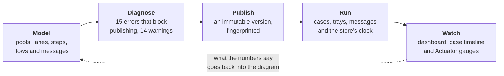
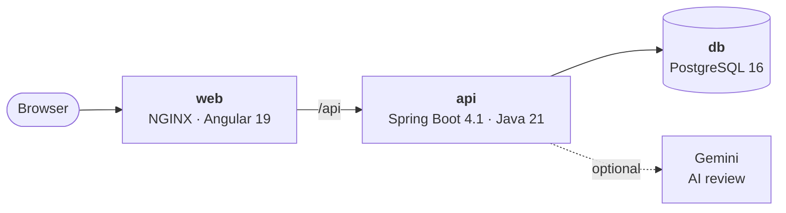
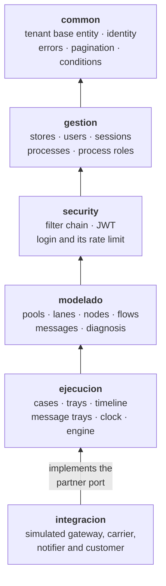

# BPMN Process Manager API

**Model, validate and run the workflows behind every online order.**

BPMN Process Manager is a multi-tenant platform where online stores draw how their orders move — from checkout to
delivery, payments and returns — as BPMN process diagrams, and then run them. Each store works in a private
workspace with role-based access, every change is validated and recorded, and a published diagram becomes an
immutable version that orders run on. This repository holds the REST API and the Angular web app built on it.

[](https://github.com/AndresContreras1/bpmn-process-manager-api/actions/workflows/ci.yml)


[](LICENSE)

> [!NOTE]
> Orders run on a clock made of ticks that somebody moves on purpose, against simulated partners. Nothing here calls
> a real payment provider or carrier, and that is the point: the same store, the same seed and the same steps always
> decide the same way, so a demo and a test can be replayed exactly.

## Contents

[What it does](#what-it-does) · [Features](#features) · [Architecture](#architecture) ·
[Quick start](#quick-start) · [Documentation](#documentation) · [Quality](#quality) ·
[Project structure](#project-structure) · [Roadmap](#roadmap) · [Credits](#credits) · [License](#license)

## What it does


```mermaid
flowchart LR
    M["<b>Model</b><br/>pools, lanes, steps,<br/>flows and messages"]
    D["<b>Diagnose</b><br/>15 errors that block<br/>publishing, 14 warnings"]
    P["<b>Publish</b><br/>an immutable version,<br/>fingerprinted"]
    R["<b>Run</b><br/>cases, trays, messages<br/>and the store's clock"]
    W["<b>Watch</b><br/>dashboard, case timeline<br/>and Actuator gauges"]

    M --> D --> P --> R --> W
    W -. "what the numbers say<br/>goes back into the diagram" .-> M
```

A store draws its process, the diagnosis refuses to publish one that would not run, and publishing freezes the
diagram into a version. From then on an order is a case walking that exact version: it stops where a person has to
act, sends what the diagram says it sends, waits for the answer, and closes. Publishing again does not move an
order that is already running — it finishes on the diagram it started with.

The [overview](docs/overview.md) explains the problem it solves, the key concepts and the guarantees it gives, and
the [order-fulfillment example](docs/example-order-fulfillment.md) walks the demo store's process step by step.

## Features

| Area | What you get | Details |
|---|---|---|
| **Modeling** | Participants, lanes, activities, gateways, events, sequence flows, message flows and correlation keys. Every change is checked against the BPMN rules, so a model never ends up in an invalid state. | [Domain model](docs/domain-model.md) |
| **Diagnosis** | A deterministic catalogue of errors and warnings, each pointing at an element, and a what-if that says what a deletion would take with it. | [Diagnosis](docs/diagnosis-and-versions.md#diagnosis) |
| **Versions** | Publishing freezes the whole diagram with a SHA-256 fingerprint. What is edited afterwards is the draft, and the process says when it is ahead. | [Versions](docs/diagnosis-and-versions.md#published-versions) |
| **Execution** | Cases that walk a published version, tasks waiting in the tray of each process role, and gateway conditions in a small language of its own that cannot run code. | [Execution](docs/execution.md#running-a-process) |
| **Messaging and simulation** | Outbox and inbox per process, correlation by key, a clock in ticks per store, and four simulated partners — payments, carrier, notifications, customer — deterministic by seed. | [Simulation](docs/execution.md#messages-and-the-clock) |
| **Dashboard** | Cases by state, cycle time with average and p95, work waiting per role and what did not go as expected, in six queries however many orders there are. | [Dashboard](docs/execution.md#the-dashboard) |
| **Security** | Short-lived JWT with rotating refresh tokens, login rate limit, roles checked in one place, and store isolation enforced by the build. Read-only sharing between stores. | [Security](docs/security.md) |
| **API contract** | OpenAPI for every operation, Problem Details errors, optimistic locking, idempotency keys and stable pagination. | [API reference](docs/api-reference.md) |
| **AI review** | An optional second opinion from a language model, answered in a validated schema and limited per store. It only advises. | [AI review](docs/diagnosis-and-versions.md#ai-review) |
| **Web app** | Angular client for all of it: processes, diagram viewer and editor with live diagnosis, administration, cases, tasks, clock and dashboard. | [frontend/](frontend/README.md) |

## Architecture


```mermaid
flowchart LR
    B(["Browser"]) --> W["<b>web</b><br/>NGINX · Angular 19"]
    W -- "/api" --> A["<b>api</b><br/>Spring Boot 4.1 · Java 21"]
    A --> D[("<b>db</b><br/>PostgreSQL 16")]
    A -. "optional" .-> G["Gemini<br/>AI review"]
```

The browser only talks to the web container: NGINX serves the app and forwards `/api` inside the network, so there
is no API URL baked into the build and no CORS to configure. Inside the API, the code is split into modules that
only depend downwards:


```mermaid
flowchart BT
    common["<b>common</b><br/>tenant base entity · identity<br/>errors · pagination · conditions"]
    gestion["<b>gestion</b><br/>stores · users · sessions<br/>processes · process roles"]
    security["<b>security</b><br/>filter chain · JWT<br/>login and its rate limit"]
    modelado["<b>modelado</b><br/>pools · lanes · nodes · flows<br/>messages · diagnosis"]
    ejecucion["<b>ejecucion</b><br/>cases · trays · timeline<br/>message trays · clock · engine"]
    integracion["<b>integracion</b><br/>simulated gateway, carrier,<br/>notifier and customer"]

    gestion --> common
    security --> gestion
    modelado --> security
    ejecucion --> modelado
    integracion -- "implements the<br/>partner port" --> ejecucion
```

Each module is layered as controller → service interface → implementation → repository → entity, with DTOs and
MapStruct mappers at its edge. ArchUnit fails the build if an arrow points backwards, if a service reads without the
store's id, or if a request DTO carries one.

| Layer | Technology |
|---|---|
| Backend | Java 21 · Spring Boot 4.1 · Spring Security 7 · JWT (jjwt) · Spring Data JPA · Hibernate 7.4 · MapStruct |
| Data | PostgreSQL 16 in `prod` · H2 in `dev` and tests · Flyway migrations, validated by Hibernate |
| Frontend | Angular 19 standalone · Bootstrap 5 · RxJS · NGINX |
| Quality | JUnit 5 · Mockito · ArchUnit · Testcontainers · Selenium · k6 · JaCoCo · SonarCloud |
| Delivery | Docker multi-stage images · Docker Compose · GitHub Actions |

[Architecture](docs/architecture.md) covers the request lifecycle, the module boundaries and the published-version
cache; [Design decisions](docs/design-decisions.md) explains the choices behind them.

## Quick start

**The API with demo data** (JDK 21):

```bash
./mvnw spring-boot:run
```

It starts on `http://localhost:8080` with the `dev` profile: an H2 file under `./data` and *Demo Store* already
seeded with a published order-fulfillment process. Swagger UI is at `/swagger-ui.html`.

**The web app** (Node.js 22+), in a second terminal:

```bash
cd frontend
npm ci
npm start
```

It opens on `http://localhost:4200` and forwards `/api` to the API.

| Demo account | Email | Password |
|---|---|---|
| Demo Store administrator | `admin@demo.com` | `admin123` |

**The whole stack**, database, API and web, closer to production:

```bash
cp .env.example .env     # DB_PASSWORD and JWT_SECRET have no default on purpose
docker compose up -d --build --wait
```

The app is then on `http://localhost`. This stack runs the `prod` profile and starts empty: register a store from
the app and its account becomes the first administrator. [Getting started](docs/getting-started.md) has the first
requests with curl, the Postman collection, the end-to-end tests and the operations endpoints, and
[Configuration](docs/configuration.md) lists every environment variable.

## Documentation

| | |
|---|---|
| **Product** | [Overview](docs/overview.md) · [Example: order fulfillment](docs/example-order-fulfillment.md) |
| **Running it** | [Getting started](docs/getting-started.md) · [Configuration](docs/configuration.md) |
| **How it works** | [Domain model and rules](docs/domain-model.md) · [Diagnosis, versions and AI review](docs/diagnosis-and-versions.md) · [Execution and simulation](docs/execution.md) · [Security](docs/security.md) · [API reference](docs/api-reference.md) |
| **Engineering** | [Architecture](docs/architecture.md) · [Quality and testing](docs/testing.md) · [Design decisions](docs/design-decisions.md) · [Roadmap](docs/roadmap.md) |
| **Clients** | [Web app](frontend/README.md) · [End-to-end tests](e2e/README.md) · [Postman collection](postman/) |

## Quality

```bash
./mvnw verify
```

- **1176 tests** in the build: architecture rules, controller and repository slices, service units, security and
  store isolation, and integration across modules. Another **79** run the same suites against a real PostgreSQL 16
  with Testcontainers.
- **Coverage gate** with JaCoCo: 96 % of lines and 85 % of branches today, and the build fails below 90 % and 80 %
  in the service packages, where the business rules live.
- **Every pull request** runs nine jobs: build and test on Ubuntu and Windows, architecture rules, PostgreSQL
  integration, Docker image with k6 load tests, SonarCloud quality gate, frontend build, web image with the whole
  stack, Selenium end-to-end tests against it, and the supply chain checks; CodeQL runs beside them.
- **Supply chain**: every action pinned to a commit SHA, Dependabot, CodeQL, gitleaks over every commit, Trivy over
  both images, and a CycloneDX SBOM of each. [Supply chain](docs/security.md#supply-chain) has the detail.

[Quality and testing](docs/testing.md) breaks every suite down.

## Project structure

```text
├── src/main/java/…/procesos   the API: common · security · gestion · modelado · ejecucion · integracion
├── src/main/resources         profiles and Flyway migrations (common, h2, postgresql)
├── src/test                   unit, slice, integration, architecture and PostgreSQL suites
├── frontend/                  Angular web app and its NGINX image
├── e2e/                       Selenium end-to-end suite, a separate Maven module
├── k6/                        load tests: a sales peak and an order peak
├── postman/                   collection that tours the API end to end
├── docs/                      the detailed documentation
├── compose.yaml               db, api and web
└── Dockerfile                 multi-stage image of the API, run as a non-root user
```

## Roadmap

Everything planned for modeling, execution, simulation, security and quality is done. Next is reviewing a change
instead of the whole diagram, so the model only reads what moved. The [roadmap](docs/roadmap.md) lists every item.

## Credits

This project began as a five-person team project for the Web Development course of my Systems Engineering degree,
in the team repository [Facimus-Curiositatem/Beta-back](https://github.com/Facimus-Curiositatem/Beta-back). My
contributions there were the stateless security (filter chain, JWT, `ApiPrincipal`, Problem Details for `401` and
`403`, CORS) and the multi-tenancy and authorization (tenant checks on every lookup, the cross-tenant `404` policy,
the centralized role matrix, the ArchUnit isolation rules and the two-store integration suite).

This repository is my personal continuation. It evolves independently from the team version and is oriented to
e-commerce operations.

## License

[MIT](LICENSE). Use it, read it, take what is useful.
