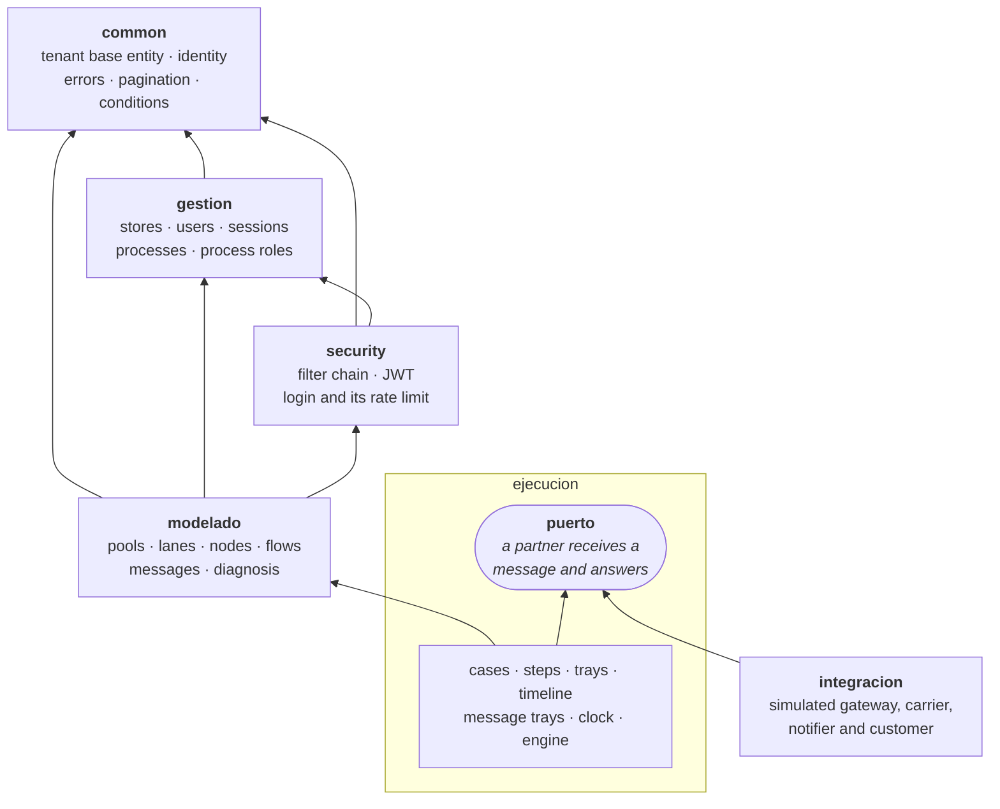
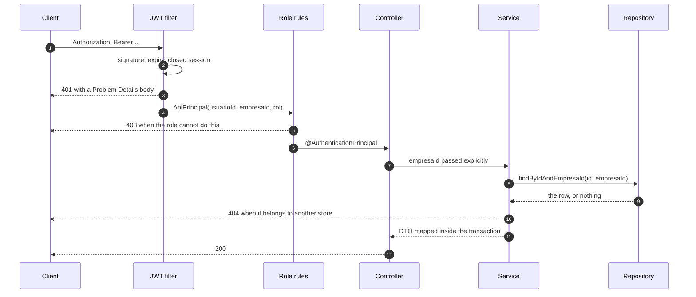

[← Documentation](README.md)

# Architecture

## Technology stack

| Area | Technology |
|---|---|
| Language | Java 21 |
| Framework | Spring Boot 4.1 (Web MVC, Validation, Data JPA, Security 7) |
| Persistence | Hibernate 7.4 · Flyway 12 · H2 (`dev` and tests) · PostgreSQL (`prod`) |
| Security | Spring Security `AuthenticationManager` · JWT (jjwt 0.12.6, HS256) · BCrypt · SHA-256-hashed refresh tokens |
| API documentation | springdoc-openapi 3 (OpenAPI 3 and Swagger UI) |
| Web app | Angular 19 · Bootstrap 5 · RxJS |
| Testing | JUnit 5 · Mockito · MockMvc · AssertJ · ArchUnit 1.4 · JaCoCo · Testcontainers · Selenium · k6 |
| Tooling | Maven Wrapper · Lombok · MapStruct · Docker · GitHub Actions · SonarCloud |

## Modules

The code is split into four business modules and two shared packages, and they stack: `common` depends on nobody,
`gestion` on `common`, `security` on both, `modelado` on the three, `ejecucion` on all of them, and `integracion`
only on the port `ejecucion` publishes. Each business module is layered as controller → service interface →
service implementation → repository → model, with `dto` for the module's contract and `mapper` for the MapStruct
translations.



An arrow means *depends on*. The only one that points the other way is the last: `ejecucion` publishes the port and
`integracion` implements it, so the engine asks for the partner of a kind of participant and works with whatever it
is given. ArchUnit checks every one of these arrows, and the absence of the ones that are not drawn.

| Package | Responsibility |
|---|---|
| `common` | What every module needs: the store and the access role, the authenticated identity (`ApiPrincipal`), the tenant base entity and the tenant-aware repository contract, business exceptions, Problem Details, pagination |
| `security` | Filter chain, the authentication endpoints, login and its rate limit, JWT issuing and validation, closed sessions, `401` and `403` handlers, CORS |
| `gestion` | Management: stores, users and their sessions, processes, process roles and change history |
| `modelado` | BPMN modeling: pools, lanes, activities, gateways, sequence flows, message flows and correlation keys |
| `ejecucion` | Running a published version: cases, the steps they go through, the tray of tasks, the timeline, the two message trays, the store's clock and the engine that moves them. It publishes the port the partner on the other side of a message is asked through |
| `integracion` | The simulated partners behind that port: the payment gateway, the carrier, the notifications provider, the customer, and the echo that stands in for a participant with no partner of its own. They receive a message and answer; they know nothing about cases, trays or who called them, and they open no connections |

## Request lifecycle

1. The JWT filter validates the token and builds an `ApiPrincipal` (`usuarioId`, `empresaId`, role and session) from
   its claims, without a database query. A token whose session was closed is rejected.
2. The role rules decide `401` or `403` before any controller runs.
3. Controllers receive the principal with `@AuthenticationPrincipal` and pass `empresaId` explicitly to the services.
4. Every lookup by id goes through `findByIdAndEmpresaId`, so a resource from another store does not exist for the
   caller.
5. The service maps the result to a DTO inside its transaction. Entities never reach the controller.



The `404` at the end is the whole multi-tenancy policy in one line: a resource of another store does not answer
`403`, because that would confirm it exists. It does not exist for the caller.

## Module boundaries

`modelado` builds on the processes and roles of `gestion`, so `gestion` never depends on `modelado`. When a process
is created, `gestion` publishes a `ProcesoCreado` event and `modelado` creates the store's pool in the same
transaction. When a process is deleted, a `ProcesoEliminado` event lets `modelado` retire the model. To know whether
a process role is in use, `gestion` asks the `UsoDeRoles` port, which `modelado` implements on top of its lanes.
Publishing works the same way: `gestion` owns the versions but not the diagram, so it asks the
`DiagnosticoDelModelo` and `InstantaneaDelModelo` ports for the errors that block publishing and for the diagram to
freeze.

`ejecucion` sits on top of all of them: it reads the published version through the service that owns it and the
diagram through the DTOs that `modelado` already answers with, and nothing below ever looks back at it, which
another ArchUnit rule checks. The language of the conditions is the one thing both sides need — the diagnosis to
refuse publishing one that does not compile, the engine to evaluate it — so it lives in `common` rather than in
either of them.

The partner on the other side of a message is the one place the direction turns around. `ejecucion` publishes a
port — a partner receives a message and answers — and `integracion` implements it; the engine asks for the partner
of a kind of participant and works with whatever it is given. Three ArchUnit rules hold that line: a simulated
partner cannot reach into the services, repositories or entities of the execution, it cannot open a connection to
anything (one that did would stop being a simulation, and the tests would start depending on something outside
answering), and the port itself cannot mention an entity, or whoever implements it would have to know the
database.

The same rule holds one level up. What every module needs — the store, the access role and the identity of whoever
is calling — lives in `common`, so nothing has to reach sideways for it, and the authentication endpoints live with
the rest of `security` instead of with the management of the store. An ArchUnit rule checks that the packages keep
stacking, at the top level and inside each module.

## The published-version cache

A published version never changes: publishing freezes the diagram and retiring a version does not rewrite it. So
what a version *says* is kept in memory — the JSON of its diagram, and the graph the engine walks, with the
conditions of its flows already compiled and the reachable set of every node already worked out — and what
*changes* is never kept: which version is in force, and whether whoever is asking may read that process, are
questions the database answers on every single request. That is why there is no invalidation to get wrong. Nothing
has to be evicted when a version is published or retired, because the key is the version and not the process, and
a request that arrives one millisecond after a publish cannot be served the previous diagram.

**The key starts with the store.** Version ids are unique across the whole system, so today it is not needed to
find the right entry; it is needed so that a key written tomorrow, for a resource whose ids do repeat between
stores, cannot hand one store what another one put there. An ArchUnit rule fails the build if a cache key does not
name the store — storing is also a way of reading.

**Running a case, a hit costs no query at all.** The version arrives as a lazy proxy, because it comes from the
case; its id is known without waking it and its diagram is only read when the cache misses. A test counts the
statements: the first read costs one, the second costs zero, and the graph that comes back is the same object.

| `k6/pico-de-pedidos.js` · ten virtual users · forty seconds | p95 of each run | req/s of each run |
|---|---|---|
| Three-node process · cache off · 2 runs | 33.7 · 36.9 ms | 264 · 281 |
| Three-node process · cache on · 2 runs | 31.7 · 35.1 ms | 274 · 295 |
| Thirty-three-node process (`PASOS=30`) · cache off · 4 runs | 29.2 · 29.4 · 31.9 · 32.2 ms | 281 · 290 · 304 · 306 |
| Thirty-three-node process (`PASOS=30`) · cache on · 4 runs | 28.7 · 31.3 · 31.5 · 32.2 ms | 286 · 287 · 294 · 311 |

**The ranges overlap, and that is the result.** Same image, same data, runs alternating so that a machine warming
up cannot be mistaken for a change; the only difference between them is the environment variable. Two runs of the
same configuration differ by more than the two configurations differ from each other, so publishing one of those
pairs as a speed-up would be publishing noise. On a laptop, against Docker Desktop, with ten virtual users and a
database in another container, the time goes to the database and to the network — not to parsing a diagram.

So what this cache is measured by is not a p95, it is a count that no machine can move: completing a task,
advancing an order or delivering a message used to read the version row and build its graph **every single time**.
Now the first one does and the rest read nothing, and a test asserts exactly that — one statement, then zero. The
milliseconds show up in a load profile this laptop cannot produce: many stores, big diagrams, and a database that
is not the bottleneck.

Both rows come out of the same script. `PASOS` lengthens the chain of the process it builds with that many more
tasks, so the same peak runs over a diagram ten times bigger while the operations stay identical:

```bash
# The stack, and then the peak inside its network: --network host does not reach the host on Docker Desktop
docker compose up -d --wait db api
docker run --rm -i --network bpmn-process-manager-api_default -e BASE_URL=http://api:8080 -e PASOS=30   grafana/k6:0.54.0 run - < k6/pico-de-pedidos.js
```

Actuator counts the hits next to the operation gauges: `cache.gets` tagged `cache=grafos-de-version` or
`cache=definiciones-de-version` and `result=hit` or `miss`, `cache.size`, `cache.evictions`. And
`CACHE_VERSIONES=false` turns the whole thing off — the API answers exactly the same, only reading and parsing
again every time — which is how the test suite runs, so that no test can be reading what the one before it left
behind.

## Data that does not pile up

Three tables only grow. A login writes a session, every renewal writes a refresh token, and every request with an
`Idempotency-Key` writes a key; nothing reads any of them once they expire. A job sweeps them every night
(`LIMPIEZA_CRON`, 3:30 by default):

- **Refresh tokens** that expired more than `LIMPIEZA_RETENCION_SESIONES` ago. An expired one renews nothing.
- **Sessions** older than that same window with no refresh token left, which can no longer issue anything. The
  window is never shorter than the access token lifetime: when the API restarts it rereads the sessions closed
  recently to keep rejecting their tokens, so deleting one too early would let a revoked token back in.
- **Idempotency keys** older than `LIMPIEZA_RETENCION_IDEMPOTENCIA`.

This is the only place in the API where a row is really deleted; everything else is a soft delete and stays.
