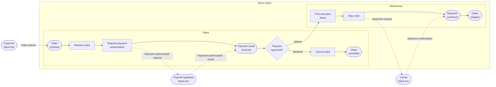

[← Documentation](README.md)

# Example: order fulfillment

The platform starts with a demo store, *Demo Store*. It has a published *Order fulfillment* process that uses every
element of the notation, and a draft *Returns and refunds* process that is ready to be modeled. Sign in as
`admin@demo.com` with the password `every-order-on-time` (see [Getting started](getting-started.md)).

Solid arrows are the sequence flow, dotted ones the messages. The two lanes are the two trays: *Sales* sees steps 2
and 6, *Warehouse* sees 8 and 9, and a case sits in one of them until somebody completes it.

**Participants**

| Participant | Type | Detail |
|---|---|---|
| Demo Store | The store | Two lanes: *Sales* and *Warehouse* |
| Customer | Customer | Black box: the store does not model its internals |
| Payment gateway | External system | Black box |
| Carrier | Supplier | Black box |

**Steps**

| # | Step | Kind | Lane | What happens |
|---|---|---|---|---|
| 1 | Order received | Message start event | Sales | The order of a customer starts the process. |
| 2 | Receive order | Activity, done by a person | Sales | Validate the cart, the stock and the shipping address. |
| 3 | Request payment authorization | Activity that sends a message | Sales | Send the order total to the payment gateway. |
| 4 | Payment result received | Intermediate message event | Sales | Wait for the answer of the payment gateway. |
| 5 | *Payment approved?* | Exclusive gateway | Sales | `payment.status == APPROVED` continues to step 8, and `payment.status == DECLINED` goes to step 6. |
| 6 | Cancel order | Activity, done by the store | Sales | Release the reserved stock and notify the customer. |
| 7 | Order cancelled | End event | Sales | The order ends without a shipment. |
| 8 | Pick and pack items | Activity, done by a person | Warehouse | Collect the items and prepare the package. |
| 9 | Ship order | Activity that sends a message | Warehouse | Hand the package over to the carrier. |
| 10 | Shipment confirmed | Intermediate message event | Warehouse | Wait for the carrier to confirm the shipment. |
| 11 | Order shipped | End event | Warehouse | The order ends on its way to the customer. |

**Messages**, all correlated by the `orderId` field of their body

| Message | From | To | Anchored at | How it travels | If it fails |
|---|---|---|---|---|---|
| Order placed | Customer | Demo Store | *Order received* | — | — |
| Payment authorization request | Demo Store | Payment gateway | *Request payment authorization* | Web service | Handled by *Cancel order* |
| Payment authorization result | Payment gateway | Demo Store | *Payment result received* | — | — |
| Shipment request | Demo Store | Carrier | *Ship order* | Queue | The process continues |
| Shipment confirmation | Carrier | Demo Store | *Shipment confirmed* | — | — |
| Order status notification | Demo Store | Customer | *Cancel order* | Email | The process continues |

The payment result arrives as `payment`, so the gateway of step 5 reads `payment.status`. Only *Order placed*
opens a case: the rest are matched to one that is already open.

The [diagnosis](diagnosis-and-versions.md#diagnosis) of this process answers no errors and one warning on purpose: neither branch of step 5
is marked as the default one, so an answer that is neither approved nor declined would leave the order with no
path. Marking the rejection as the default flow clears it, and it is there to be seen.

This process starts with a message, so an order of it is not opened by hand: it is opened by sending *Order placed*,
one at a time or in a batch from the simulated customer, as [Execution and simulation](execution.md) describes. A
process that starts with a plain start event is opened by hand instead.
